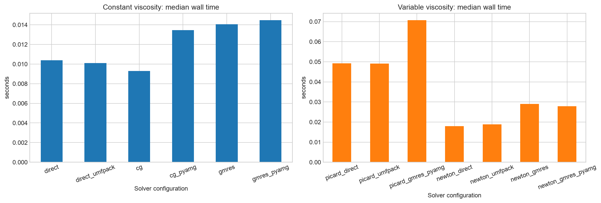
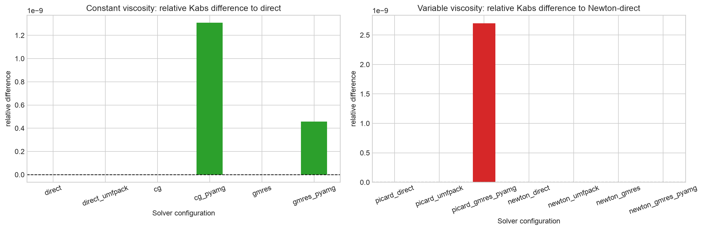
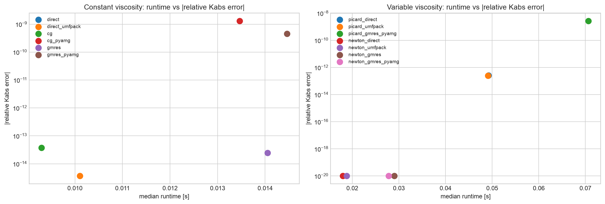
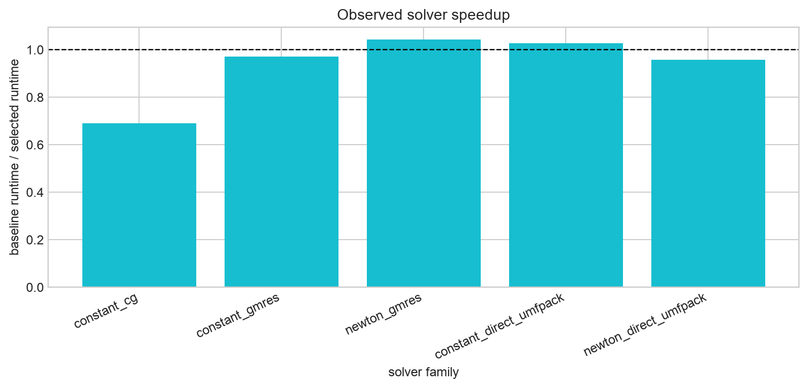
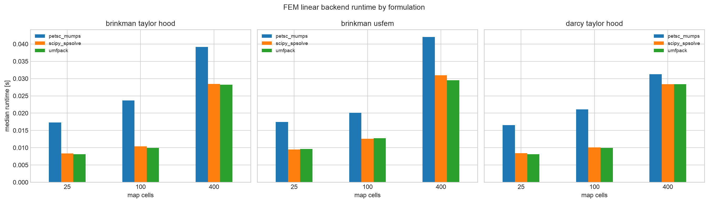
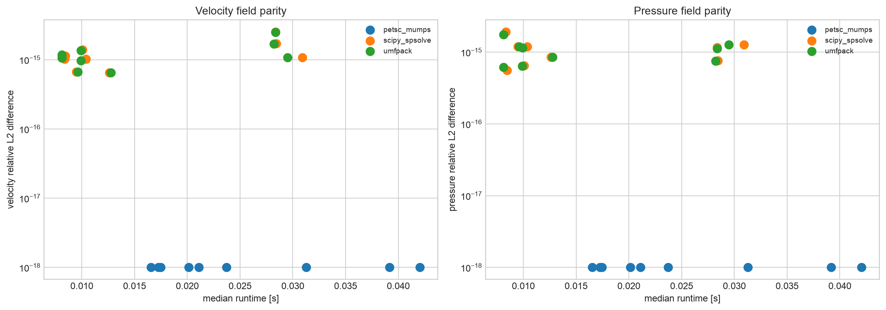

# Solver Backends And Performance

`voids` exposes sparse linear solver choices in two layers:

- PNM and TPFA use the shared `voids.linalg.solve.solve_linear_system`
  interface.
- FEM uses DOLFINx assembly and selects a linear algebra path through
  `FEniCSSolverOptions.linear_backend`.

The solver backend is a numerical linear algebra choice. It should not change
the pore-network equations, the TPFA discretization, the FEM weak form, the
boundary conditions, or the porosity/permeability map closure. If two direct
backends disagree beyond roundoff on the same assembled problem, treat that as a
numerical diagnostic before interpreting the permeability physically.

## Installation

The Pixi `default` and `test` environments include the solver feature:

```bash
pixi run -e test python -c "import voids.linalg.solve; import voids.fem.singlephase"
```

Plain `pip install voids` keeps optional solver stacks separate. Install Python
solver helpers with:

```bash
pip install "voids[solvers]"
```

This extra installs PyAMG but not `scikit-umfpack`: building the latter from its
PyPI source distribution requires a native SWIG/SuiteSparse toolchain. Use the
binary conda-forge package when selecting the explicit UMFPACK backend.

FEM still requires a compatible DOLFINx/FEniCSx installation. The repository's
Pixi package definition records DOLFINx and binary UMFPACK as conda runtime
dependencies, which allows a published conda `voids` artifact to supply them
transitively. On native Windows,
the conda-forge DOLFINx stack used by `voids` does not provide the PETSc-backed
`dolfinx.fem.petsc` path, so FEM `linear_backend="auto"` falls back to the
serial SciPy/SuperLU sparse direct backend when PETSc is unavailable.

## PNM And TPFA Backends

PNM and TPFA call `solve_linear_system(A, b, method=...)` after assembling their
sparse systems.

| Method | Backend | Typical use | Main caveat |
|---|---|---|---|
| `"direct"` | `scipy.sparse.linalg.spsolve` | default sparse direct solve | with `dtype="float32"`, `voids` disables SciPy's optional UMFPACK dispatch so the solve can stay single precision |
| `"superlu"` | `scipy.sparse.linalg.splu` | explicit portable CPU direct solve; useful for comparing `float64` and `float32` | serial sparse factorization |
| `"umfpack"` | `scikits.umfpack.spsolve` | explicit SuiteSparse/UMFPACK direct solve, including Windows fallback studies | requires `scikit-umfpack` and UMFPACK libraries; currently double precision only through the Python wrapper |
| `"pardiso"` | `pypardiso.spsolve` | Linux MKL/PARDISO direct solve | not a portable Windows fallback; currently double precision only through `pypardiso` |
| `"nvmath_cudss"` | CSR matrix copied to CUDA tensors and solved with `nvmath.bindings.cudss` | experimental GPU direct path for CUDA workstations | requires PyTorch with CUDA and nvmath/cuDSS at runtime; optional single-node multi-GPU cuDSS handle |
| `"cg"` | SciPy conjugate gradient | symmetric positive systems | convergence depends on conditioning and tolerances |
| `"gmres"` | SciPy GMRES | nonsymmetric or harder systems | restart and tolerance choices matter |

Backends that support runtime value precision selection accept
`solver_parameters={"dtype": "float64"}` or
`solver_parameters={"dtype": "float32"}`. For portable CPU direct
single-precision tests, prefer the explicit `"superlu"` method:

```python
from voids.physics.singlephase import SinglePhaseOptions
from voids.fvm.singlephase import solve_tpfa

network_options = SinglePhaseOptions(
    solver="superlu",
    solver_parameters={"dtype": "float32"},
)
tpfa_result = solve_tpfa(
    permeability_map,
    solver_method="superlu",
    solver_parameters={"dtype": "float32"},
)
```

`cg` and `gmres` also accept optional PyAMG preconditioning:

```python
from voids.physics.singlephase import SinglePhaseOptions

options = SinglePhaseOptions(
    solver="gmres",
    solver_parameters={
        "rtol": 1.0e-10,
        "maxiter": 800,
        "restart": 80,
        "preconditioner": "pyamg",
    },
)
```

Explicit UMFPACK for PNM:

```python
from voids.physics.singlephase import SinglePhaseOptions

options = SinglePhaseOptions(solver="umfpack")
```

Explicit UMFPACK for TPFA:

```python
from voids.fvm.singlephase import solve_tpfa

result = solve_tpfa(permeability_map, solver_method="umfpack")
```

Experimental cuDSS for PNM or TPFA:

```python
from voids.physics.singlephase import SinglePhaseOptions
from voids.fvm.singlephase import solve_tpfa

network_options = SinglePhaseOptions(
    solver="nvmath_cudss",
    solver_parameters={"device_ids": 0, "dtype": "float64"},
)
tpfa_result = solve_tpfa(
    permeability_map,
    solver_method="nvmath_cudss",
    solver_parameters={"device_ids": 0, "dtype": "float64"},
)
```

On a workstation with multiple compatible CUDA devices, pass a sequence or
`"all"` to request a cuDSS multi-GPU handle:

```python
gpu_options = {"device_ids": (0, 1), "dtype": "float64"}
```

## FEM Backends

FEM backends use the same DOLFINx/UFL forms and coefficient maps, then select
the linear solve path:

| `linear_backend` | Linear algebra path | Platform role | Main caveat |
|---|---|---|---|
| `"auto"` | PETSc when available; SciPy/SuperLU fallback on native Windows when PETSc is missing | recommended default for portable scripts | resolved backend can differ by platform |
| `"petsc"` | DOLFINx PETSc `LinearProblem` with PETSc options from `FEniCSSolverOptions` | production Linux/macOS path; supports PETSc/MPI workflows | unavailable in native Windows conda-forge DOLFINx stack used by `voids`; precision follows the installed PETSc/DOLFINx scalar type |
| `"superlu"` | DOLFINx assembly converted to SciPy CSC format and solved with SciPy's SuperLU wrapper | preferred explicit serial SuperLU backend; supports `linear_system_dtype="float64"` and `"float32"` | serial-only |
| `"scipy"` | Backward-compatible alias for the SciPy/SuperLU path | serial direct fallback and comparison backend; supports `linear_system_dtype="float64"` and `"float32"` | serial-only |
| `"umfpack"` | DOLFINx assembly converted to SciPy CSC format and solved with the 64-bit-index `scikits.umfpack.UmfpackContext("dl")` path | explicit serial SuiteSparse/UMFPACK path | requires `scikit-umfpack`; serial-only; currently double precision only |
| `"pardiso"` | DOLFINx assembly converted to SciPy CSR format and solved with `pypardiso.spsolve` | Linux MKL/PARDISO direct path | Linux-only optional dependency; serial-only; currently double precision only |
| `"nvmath_cudss"` | DOLFINx assembly converted to SciPy CSR format, copied to CUDA tensors, and solved with `nvmath.bindings.cudss` | experimental GPU direct path for CUDA workstations | requires PyTorch with CUDA and nvmath/cuDSS at runtime; serial assembly; not a portable default |

Default portable behavior:

```python
from voids.fem.singlephase import FEniCSSolverOptions, upscale_permeability_fem

result = upscale_permeability_fem(problem, options=FEniCSSolverOptions())
print(result.results["x"].metadata["linear_backend"])
```

Force PETSc, SuperLU, SciPy/SuperLU alias, or UMFPACK:

```python
from voids.fem.singlephase import FEniCSSolverOptions

petsc_options = FEniCSSolverOptions.direct_lu("mumps")
superlu_options = FEniCSSolverOptions.superlu_direct()
superlu_float32_options = FEniCSSolverOptions.superlu_direct(
    linear_system_dtype="float32"
)
scipy_alias_options = FEniCSSolverOptions.scipy_direct()
umfpack_options = FEniCSSolverOptions.umfpack_direct()
```

On CUDA workstations with a compatible nvmath/cuDSS runtime, the same optional
`"nvmath_cudss"` backend can be requested explicitly for FEM:

```python
cudss_options = FEniCSSolverOptions.nvmath_cudss_direct(device_ids=0)
```

The `voids` default controls for this cuDSS backend use `dtype="float64"`,
matching, and five iterative-refinement steps. A fresh cuDSS configuration in
the tested nvmath/cuDSS stack reports `IR_N_STEPS = 0`; `voids` sets
`ir_steps=5` explicitly unless the caller overrides it. The backend also checks
the assembled-system relative residual before accepting the solution. Pass one
`device_ids` value to
select a CUDA device, pass a sequence such as `(0, 1)` to request a single-node
multi-GPU cuDSS handle, or pass `"all"` to use all CUDA devices visible to
PyTorch. The path still performs serial DOLFINx assembly, builds one SciPy CSR
system on the host, and copies the input matrix/vector to the first requested
CUDA device; cuDSS then manages the internal multi-GPU direct factorization.
This backend is intentionally optional and should be compared against a
same-map direct reference before using it for scientific claims.

USFEM Brinkman block solves also have an experimental Schurdiag/cuDSS iterative
preset:

```python
from voids.fem.singlephase import FEniCSSolverOptions, solve_brinkman_usfem_block

options = FEniCSSolverOptions.usfem_schurdiag_cudss_experimental(
    dtype="float64",
    device_ids=(0, 1),
)
result = solve_brinkman_usfem_block(problem, options=options)
```

This preset is specific to `solve_brinkman_usfem_block`. It uses PETSc/DOLFINx
to assemble the velocity/pressure block forms in one Python process, then solves
the monolithic system with SciPy GMRES and a lower-Schur preconditioner. The
velocity block uses PyAMG by default, and the pressure correction uses
`S_hat = A_pp - A_pu diag(A_uu)^-1 A_up`, factored once with cuDSS and reused
for every GMRES pressure correction. Use `velocity_solver="exact"` if you want
a SciPy SuperLU velocity-block solve instead of PyAMG on small comparison
cases. The preset records GMRES residuals, Schurdiag sizes, cuDSS factor times,
device ids, and cuDSS memory estimates in result metadata.

The Schurdiag/cuDSS preset is not a replacement for direct references. It is a
single-process GPU-assisted iterative path for medium and large USFEM maps where
the pressure Schur approximation is much cheaper to factor with cuDSS than with
CPU direct solvers. Start with `dtype="float64"`; local high-contrast probes
showed good permeability and field agreement in double precision, while
single-precision Schurdiag preconditioning could produce small final GMRES
residuals but poor pressure-field agreement.

For pressure factors that do not fit in device memory, cuDSS hybrid memory mode
can be requested:

```python
large_options = FEniCSSolverOptions.usfem_schurdiag_cudss_experimental(
    dtype="float64",
    device_ids=(0, 1),
    hybrid_mode=True,
    hybrid_device_memory_limit=20_000_000_000,
)
```

Hybrid memory should be treated as a capacity fallback, not a speed setting. On
the local two-A5000 workstation, a 300^3 synthetic image reduced to a 30^3 map
exceeded non-hybrid cuDSS device memory during the Schurdiag pressure
factorization; enabling hybrid memory avoided that immediate allocation failure
and entered GMRES, but the run was still too slow for a default benchmark row.
For monolithic USFEM direct solves, the same workstation solved 10^3, 20^3, and
30^3 maps in `float64`, but a 500^3 synthetic image reduced to a 50^3 map did
not produce an accepted direct cuDSS result: non-hybrid `float64` exceeded
device-memory estimates, hybrid `float64` failed in the installed multi-GPU
cuDSS path, and hybrid `float32` either failed the residual check or returned
non-finite permeability/flow values.

NVIDIA documents two separate hybrid concepts: hybrid memory mode stores part
of cuDSS internal factor data in host memory while GPU kernels still perform
factorization/solve, whereas hybrid execute mode can place some computation on
the host. Do not enable both together. NVIDIA also documents
`CUDSS_CONFIG_USE_CUDA_REGISTER_MEMORY` as an option that controls
`cudaHostRegister()` use for hybrid-memory transfers; it does not by itself
enable host-memory factor storage, and the tested cuDSS runtime already enables
it by default. `host_nthreads` affects cuDSS only when a cuDSS threading-layer
library is loaded. `voids` can load the packaged `libcudss_mtlayer_gomp`
library automatically when host threading is requested, and callers can pass
`threading_lib=...` to override discovery; however, the tested nvmath/cuDSS
multi-GPU handle rejected host-threaded runs with `CUDSS_STATUS_INVALID_VALUE`,
so `voids` blocks `host_nthreads`/`threading_lib` for multi-GPU cuDSS solves in
that runtime.
See the NVIDIA cuDSS
[hybrid memory documentation](https://docs.nvidia.com/cuda/cudss/advanced_features.html#hybrid-host-device-memory-mode),
[configuration parameter documentation](https://docs.nvidia.com/cuda/cudss/types.html#cudssconfigparam-t),
and nvmath-python
[`DirectSolverOptions`](https://docs.nvidia.com/cuda/nvmath-python/0.9.0/host-apis/sparse/generated/nvmath.sparse.advanced.DirectSolverOptions.html)
for the corresponding upstream controls.

cuDSS exposes several numerical controls that can be useful for single
precision experiments on ill-conditioned maps. `voids` forwards
`ir_steps`, `use_matching`, `matching_alg`, `pivot_type`,
`pivot_threshold`, `pivot_epsilon`, `pivot_epsilon_alg`, `reordering_alg`,
`factorization_alg`, `solve_alg`, `nd_nlevels`, `host_nthreads`,
`threading_lib`, `hybrid_mode`, `hybrid_device_memory_limit`,
`hybrid_execute_mode`, `use_cuda_register_memory`, `use_superpanels`, and
`deterministic_mode` when the installed cuDSS runtime supports them. For
example, a more conservative single-precision USFEM trial can increase
iterative refinement and perturb very small pivots, but this should be treated
as a diagnostic run rather than an accepted accuracy setting:

```python
cudss_float32_usfem_trial = FEniCSSolverOptions.nvmath_cudss_direct(
    dtype="float32",
    device_ids=0,
    ir_steps=20,
    pivot_epsilon=1.0e-4,
)
```

This is still a trial configuration, not a portable default. On a 300^3
synthetic image block-averaged to a 30^3 map with porosity floor `1.0e-3`,
permeability floor `1.0e-20`, and permeability cap `1.0e-8`, this
kind of single-precision setting can reduce memory but must be judged by
same-map field errors, not just by the final linear residual or permeability.
The same caution applies to TPFA at high contrast; use `float64` or a separately
validated scaled formulation unless a same-map reference confirms the lower
precision result. Some cuDSS controls are version/backend dependent: in the
tested nvmath/cuDSS stack, explicit `reordering_alg` values `ALG_1`/`ALG_2` and
`deterministic_mode=True` raised cuDSS `NOT_SUPPORTED`.

For USFEM mixed Brinkman systems, the serial SciPy/SuperLU path can sometimes
reduce fill by disabling diagonal pivoting after the standard COLAMD
preordering:

```python
tuned_superlu = FEniCSSolverOptions.superlu_direct(
    permc_spec="COLAMD",
    diag_pivot_thresh=0.0,
)
```

Accept this only after comparison against an untuned direct reference on the
same coefficient map. This remains a serial SuperLU factorization; it is a
portable reference/medium-size backend, not a replacement for PETSc
SuperLU_DIST on large USFEM maps.

For reproducible reports, store the requested backend, the resolved backend from
result metadata, the formulation name, pressure drop, map shape, permeability
and porosity floors, `serial_sparse_linear_system_dtype` when present, and the
numerical thread environment.

Taylor-Hood Brinkman and USFEM Brinkman also accept `nondimensional=True`, or a
`BrinkmanNondimensionalization` object, to assemble a coefficient-scaled
equivalent system. The default uses the viscous scale
\(U=\Delta P L/\mu\); constant-permeability maps can also use
`velocity_scale="unit_darcy"` for \(U=\Delta P K/(\mu L)\). The returned
velocity, pressure, flow rate, and permeability remain in physical units; the
scale choices are recorded in result metadata. Use this as a conditioning and
solver-experiment control, and still compare any iterative result against a
direct reference on the same map.

## Benchmark Design

The executable benchmark is
[`17_mwe_solver_options_benchmark`](notebook_reports/17_mwe_solver_options_benchmark.md).
It writes stable plots and CSV tables under `docs/assets/solver_backends/`.
The GPU-focused notebook source
`notebooks/47_mwe_gpu_solver_backend_comparison.py` compares the optional
`"nvmath_cudss"` backend against CPU direct references for PNM, TPFA, and the
serial FEM formulations. It is not rendered into the public docs because the
CUDA runtime is optional and machine-specific.

The PNM section compares:

- SciPy direct solve,
- explicit UMFPACK direct solve,
- CG and GMRES,
- CG/GMRES with PyAMG preconditioning,
- Picard and Newton outer iterations for pressure-dependent viscosity.

The FEM section compares PETSc/MUMPS, SciPy direct sparse, and UMFPACK on
homogeneous 2-D maps for:

- Taylor-Hood Darcy-Darcy,
- Taylor-Hood Darcy-Brinkman,
- stabilized USFEM Darcy-Brinkman.

It reports permeability, flow rate, pressure field relative \(L^2\) difference,
velocity field relative \(L^2\) difference, and repeated-run wall time.

## Benchmark Results

The current benchmark data are available as CSV artifacts:

- [PNM constant-viscosity solver table](assets/solver_backends/constant_solver_benchmark.csv)
- [PNM variable-viscosity solver table](assets/solver_backends/variable_solver_benchmark.csv)
- [Solver speedup table](assets/solver_backends/solver_speedup.csv)
- [FEM backend benchmark table](assets/solver_backends/fem_linear_backend_benchmark.csv)
- [FEM backend summary table](assets/solver_backends/fem_linear_backend_summary.csv)

The headline results from the generated tables are:

| Benchmark slice | Best local median runtime | Agreement with reference |
|---|---:|---:|
| PNM constant-viscosity network solve | CG, 0.0093 s | \(K\) relative difference \(3.8 \times 10^{-14}\) |
| PNM constant-viscosity direct solve | UMFPACK, 0.0101 s | \(K\) relative difference \(3.7 \times 10^{-15}\) |
| PNM variable-viscosity Newton solve | SciPy direct, 0.0180 s | reference row |
| FEM backend summary | UMFPACK, 0.0099 s median over 9 cases | max field relative \(L^2\) difference \(2.5 \times 10^{-15}\) |
| FEM backend summary | SciPy direct, 0.0104 s median over 9 cases | max field relative \(L^2\) difference \(2.6 \times 10^{-15}\) |
| FEM backend summary | PETSc/MUMPS, 0.0211 s median over 9 cases | reference row |

These numbers are from the local serial notebook run used to generate the
committed assets. They are performance evidence for this benchmark size and
machine, not a universal backend ranking.













On the homogeneous benchmark systems, the direct sparse backends recover the
same PNM permeability and flow rate to roundoff. The FEM backends recover the
same permeability, flow rate, pressure field, and velocity field to numerical
roundoff when all requested backends are installed. Runtime ranking is local to
the benchmark machine and problem size; for larger heterogeneous 3-D maps,
repeat the notebook at the target resolution before choosing a production
backend.

## Performance Guidance

- Use `"direct"` for the most portable PNM/TPFA baseline.
- Use `"umfpack"` when you want to request SuiteSparse/UMFPACK explicitly,
  especially for Windows-compatible direct-solver studies. FEM UMFPACK solves
  force the 64-bit-index family to avoid misleading 32-bit UMFPACK workspace
  failures on larger mixed systems. For USFEM-style mixed Brinkman systems,
  start tuning with `FEniCSSolverOptions.umfpack_direct(strategy="unsymmetric")`;
  lowering `pivot_tolerance` can be faster but should be accepted only after
  comparison against a direct reference on the same coefficient map.
- Use `"pardiso"` only when the Linux MKL/PARDISO stack is available and has
  been checked against the same system.
- Use `"nvmath_cudss"` only on CUDA machines with the optional nvmath/cuDSS
  runtime installed. It is available for PNM, TPFA, and serial FEM direct
  solves; LBM does not use this sparse direct backend. On multi-GPU
  workstations, start with `device_ids=(0, 1)` or `device_ids="all"` for large
  double-precision systems that do not fit comfortably on one GPU. For USFEM
  Brinkman maps, prefer
  `FEniCSSolverOptions.usfem_schurdiag_cudss_experimental(dtype="float64",
  device_ids=(0, 1))` when you want the GPU-assisted iterative Schurdiag path.
  Keep `dtype="float64"` unless a same-map direct reference, residual check, and
  pressure/velocity field comparison justify a lower precision.
- Use Krylov methods with PyAMG when direct factorizations become too expensive,
  but record convergence tolerances and residuals.
- Use FEM `"petsc"` for PETSc/MPI or heavily configured production runs.
- Use FEM `"superlu"` or `"umfpack"` for serial Windows-compatible FEM solves
  when DOLFINx core is available but PETSc is not. The older FEM `"scipy"`
  name remains accepted as an alias for the SuperLU path. For USFEM, try
  `FEniCSSolverOptions.superlu_direct(permc_spec="COLAMD",
  diag_pivot_thresh=0.0)` when the default SuperLU pivoting creates excessive
  fill, and keep the result tied to a same-map reference comparison.

## Scientific Caveats

Solver agreement does not prove that the physical closure is correct.
Permeability estimates still depend on pore/throat geometry, map construction,
permeability floors, porosity floors, pressure conventions, side-wall
conditions, and representative-volume assumptions.
