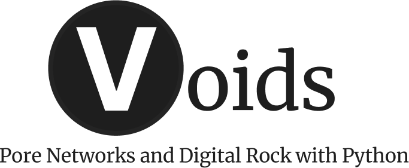

<p align="center">
  
</p>

# Overview

[](https://github.com/geomech-project/voids/actions/workflows/tests.yml)
[](https://codecov.io/gh/geomech-project/voids)
[](https://github.com/geomech-project/voids/actions/workflows/tests.yml)
[](https://pypi.org/project/voids/)
[](https://pypi.org/project/voids/)
[](https://doi.org/10.5281/zenodo.18937647)

**`voids`** is a scientific Python package for pore network modeling (PNM) aimed at
research workflows where reproducibility, explicit assumptions, and validation matter.

The current project emphasis is a clean canonical network model, interoperability with
PoreSpy/OpenPNM-style data, and a validated single-phase workflow that now includes
shape-aware conductance, pressure-dependent thermodynamic viscosity, and nonlinear
solve options before expanding to more complex multiphase physics.

---

## Why voids?

Pore network modeling research often struggles with reproducibility because the mapping
from segmented images to simulation results involves many implicit choices:

- Which pore and throat size definitions are used?
- How is the bulk volume defined relative to the image?
- What constitutive model is used for hydraulic conductance?

`voids` addresses these concerns by:

- enforcing an explicit, versioned **canonical network schema**
- requiring **provenance metadata** at construction time
- keeping **physics modules** narrowly scoped with documented assumptions
- providing **regression fixtures** to lock numerical results over time

---

## Recommended Reading Path

If you are new to the project, the shortest useful path is:

1. [Getting Started](getting_started.md) for installation and the minimal solve
2. [Concepts and Conventions](concepts.md) for the canonical data model and units
3. [Scientific Workflow](workflow.md) for image-based or imported-network studies
4. [Theoretical Background](background.md) for governing equations and assumptions
5. [Examples](examples.md) for notebook-scale workflows
6. [Verification & Validation](verification/index.md) for benchmark evidence
7. [API Reference](api/index.md) for callable details

---

## Goals

- Provide a rigorous internal representation of pore-throat networks
- Preserve sample geometry and provenance information needed for reproducible studies
- Support import and normalization of extracted networks from external tools
- Expose well-scoped physics modules with diagnostics and regression tests
- Build confidence on single-phase transport first, then expand toward richer models

---

## What `voids` Is And Is Not

`voids` is designed for explicit, scriptable scientific workflows.
It is not a GUI application, and it is not intended to replace upstream segmentation
or extraction tooling such as PoreSpy.

That division of responsibility is deliberate: segmentation assumptions and network
construction assumptions should remain visible in the provenance trail instead of
being hidden behind a single opaque entry point.

---

## Documentation Philosophy

The documentation is intended to answer two different kinds of questions:

- **Usage questions**: how to install `voids`, import a network, solve flow, and
  reproduce a workflow
- **Technical questions**: what the canonical schema means, what assumptions enter
  porosity and permeability calculations, and how the solver interprets boundary labels

Those two goals are intentionally separated across the documentation tree:

- [Getting Started](getting_started.md) and [Examples](examples.md) are task-oriented
- [Concepts and Conventions](concepts.md) and [Theoretical Background](background.md)
  are interpretation-oriented
- [API Reference](api/index.md) is interface-oriented

---

## Current Scope (v0.1.x)

| Feature | Status |
|---|---|
| Canonical `Network`, `SampleGeometry`, `Provenance` data structures | ✅ |
| Import of PoreSpy/OpenPNM-style dictionaries | ✅ |
| Geometry normalization helpers | ✅ |
| Absolute and effective porosity | ✅ |
| Connectivity metrics | ✅ |
| Single-phase incompressible flow | ✅ |
| Shape-aware Valvatne-Blunt conductance models | ✅ |
| Pressure-dependent water viscosity via `thermo` / `CoolProp` | ✅ |
| Damped Newton and Picard nonlinear solves | ✅ |
| Krylov linear solvers with optional `pyamg` preconditioning | ✅ |
| Directional permeability estimation | ✅ |
| HDF5 serialization | ✅ |
| Plotly and PyVista visualization | ✅ |
| OpenPNM cross-checks | ✅ |
| Multiphase flow | ❌ Not yet |
| Image segmentation | ❌ Delegated to PoreSpy |

---

## Quick Start

```python
from voids.examples import make_linear_chain_network
from voids.physics.petrophysics import absolute_porosity
from voids.physics.singlephase import FluidSinglePhase, PressureBC, solve

net = make_linear_chain_network()

result = solve(
    net,
    fluid=FluidSinglePhase(viscosity=1.0),
    bc=PressureBC("inlet_xmin", "outlet_xmax", pin=1.0, pout=0.0),
    axis="x",
)

print("phi_abs =", absolute_porosity(net))
print("Q =", result.total_flow_rate)
print("Kx =", result.permeability["x"])
print("mass_balance_error =", result.mass_balance_error)
```

See [Getting Started](getting_started.md) for installation and a full walkthrough.

For imported or extracted networks, the more realistic next step is
[Concepts and Conventions](concepts.md) and
[Scientific Workflow](workflow.md), which show how to attach units, geometry, and
provenance before solving.

---

## Status

`voids` is pre-alpha. The codebase is already useful for controlled PNM experiments,
solver validation, and interoperability studies, but it should not be described as a
complete pore-network simulation platform yet.

---

## Institutional Support

`voids` receives institutional support from the
[Laboratório Nacional de Computação Científica (LNCC)](https://www.gov.br/lncc/pt-br),
a research unit of the Ministério da Ciência, Tecnologia e Inovação (MCTI), Brazil.

<p align="center">
  <a href="https://www.gov.br/lncc/pt-br">
    
  </a>
</p>
