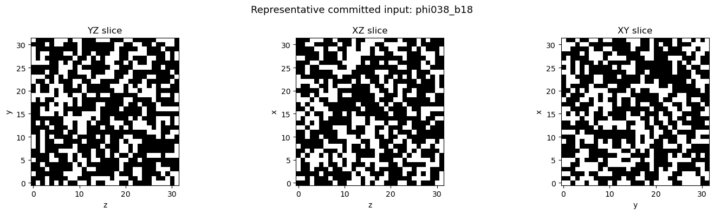
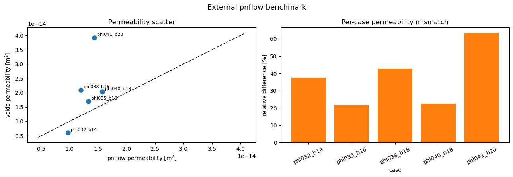
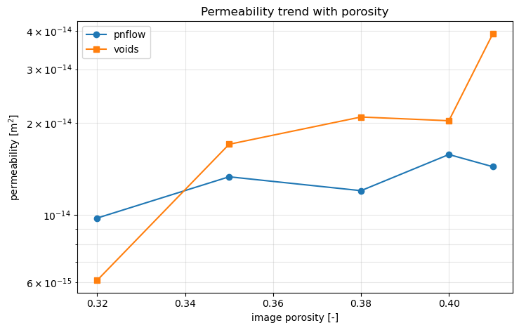

# MWE 15 - External `pnextract` / `pnflow` benchmark against `voids`

This notebook compares `voids` against a committed reference dataset produced earlier with the
Imperial College `pnextract` + `pnflow` workflow. The reference data now lives under
`examples/data/external_pnflow_benchmark/`, so this notebook does not invoke `pnextract` or
`pnflow` and remains runnable even if those binaries are unavailable in the future.

The committed benchmark bundle includes:

- the exact binary input volumes used for the benchmark
- `pnflow` report files (`*_pnflow.prt`, `*_upscaled.tsv`)
- extracted-network files (`*_node*.dat`, `*_link*.dat`) for later inspection

Scientific scope and caveats:
- this is an end-to-end workflow comparison, not a solver-only cross-check
- any mismatch reflects both extraction differences and constitutive-model differences
- the `voids` side uses `snow2` extraction plus the selected conductance model
- the external side uses previously saved `pnextract` geometry plus `pnflow`'s internal
  single-phase model
- the committed input volumes make this benchmark stable against future changes in the synthetic
  generator implementation
- we keep `mu = constant` here on purpose because the checked `pnflow` code path uses scalar fluid
  viscosities rather than a thermodynamic `mu(P, T)` coupling


```python
from __future__ import annotations

import re
from pathlib import Path

import matplotlib.pyplot as plt
import numpy as np
import pandas as pd

from voids.image import extract_spanning_pore_network
from voids.paths import data_path, project_root
from voids.physics.petrophysics import absolute_porosity, effective_porosity
from voids.physics.singlephase import (
    FluidSinglePhase,
    PressureBC,
    SinglePhaseOptions,
    solve,
)


def _require_match(pattern: str, text: str, *, label: str) -> re.Match[str]:
    match = re.search(pattern, text, flags=re.MULTILINE)
    if match is None:
        raise ValueError(f"Could not parse {label!r}")
    return match


def _parse_upscaled_metrics(path: Path, *, prefix: str) -> dict[str, float]:
    text = path.read_text()
    permeability = float(
        _require_match(
            rf"{re.escape(prefix)}_permeability:\s*([0-9.eE+-]+);",
            text,
            label=f"{prefix}_permeability",
        ).group(1)
    )
    porosity = float(
        _require_match(
            rf"{re.escape(prefix)}_porosity:\s*([0-9.eE+-]+);",
            text,
            label=f"{prefix}_porosity",
        ).group(1)
    )
    formation_factor = float(
        _require_match(
            rf"{re.escape(prefix)}_formationfactor:\s*([0-9.eE+-]+);",
            text,
            label=f"{prefix}_formationfactor",
        ).group(1)
    )
    return {
        "k_pnflow": permeability,
        "phi_pnflow": porosity,
        "formation_factor_pnflow": formation_factor,
    }


def _parse_pnflow_prt(path: Path) -> dict[str, float | int]:
    text = path.read_text()
    int_patterns = {
        "pnflow_n_pores": r"Number of pores:\s+([0-9]+)",
        "pnflow_n_throats": r"Number of throats:\s+([0-9]+)",
        "pnflow_n_inlet_connections": r"Number of inlet connections:\s+([0-9]+)",
        "pnflow_n_outlet_connections": r"Number of outlet connections:\s+([0-9]+)",
        "pnflow_n_isolated_elements": r"Number of isolated elements:\s+([0-9]+)",
    }
    float_patterns = {
        "phi_pnflow_prt": r"Total porosity:\s+([0-9.eE+-]+)",
        "k_pnflow_prt": r"Absolute permeability:\s+([0-9.eE+-]+)",
    }
    parsed: dict[str, float | int] = {}
    for key, pattern in int_patterns.items():
        value = _require_match(pattern, text, label=key).group(1)
        parsed[key] = int(value)
    for key, pattern in float_patterns.items():
        value = _require_match(pattern, text, label=key).group(1)
        parsed[key] = float(value)
    return parsed


def _load_reference_case(
    reference_root: Path, row: pd.Series
) -> tuple[np.ndarray, dict[str, object]]:
    case = str(row["case"])
    volume = np.load(reference_root / str(row["volume_file"]))
    prt_path = reference_root / str(row["pnflow_prt_file"])
    upscaled_path = reference_root / str(row["pnflow_upscaled_file"])
    metrics: dict[str, object] = {
        **_parse_upscaled_metrics(upscaled_path, prefix=case),
        **_parse_pnflow_prt(prt_path),
        "reference_case_dir": str((reference_root / case).relative_to(project_root())),
    }
    return np.asarray(volume, dtype=bool), metrics


def _run_voids_case(
    volume: np.ndarray,
    *,
    voxel_size: float,
    flow_axis: str,
    fluid: FluidSinglePhase,
    options: SinglePhaseOptions,
) -> dict[str, float | int]:
    extract = extract_spanning_pore_network(
        volume.astype(int),
        voxel_size=voxel_size,
        flow_axis=flow_axis,
        provenance_notes={"benchmark_kind": "external_pnflow_reference"},
    )
    bc = PressureBC(
        f"inlet_{flow_axis}min",
        f"outlet_{flow_axis}max",
        pin=2.0e5,
        pout=0.0,
    )
    result = solve(
        extract.net,
        fluid=fluid,
        bc=bc,
        axis=flow_axis,
        options=options,
    )
    return {
        "phi_image": float(np.asarray(volume, dtype=bool).mean()),
        "phi_abs_voids": float(absolute_porosity(extract.net)),
        "phi_eff_voids": float(effective_porosity(extract.net, axis=flow_axis)),
        "Np_voids": int(extract.net.Np),
        "Nt_voids": int(extract.net.Nt),
        "k_voids": float(result.permeability[flow_axis]),
        "Q_voids": float(result.total_flow_rate),
    }


def _make_permeability_comparison_figure(
    summary_frame: pd.DataFrame,
    *,
    output_path: Path,
) -> None:
    fig, axes = plt.subplots(1, 2, figsize=(13, 4.5))

    kmin = float(min(summary_frame["k_voids"].min(), summary_frame["k_pnflow"].min()))
    kmax = float(max(summary_frame["k_voids"].max(), summary_frame["k_pnflow"].max()))
    pad = 0.05 * max(kmax - kmin, 1.0e-30)

    axes[0].scatter(
        summary_frame["k_pnflow"], summary_frame["k_voids"], s=65, color="tab:blue"
    )
    axes[0].plot(
        [kmin - pad, kmax + pad],
        [kmin - pad, kmax + pad],
        color="black",
        lw=1.2,
        linestyle="--",
    )
    for row in summary_frame.itertuples(index=False):
        axes[0].annotate(
            row.case,
            (row.k_pnflow, row.k_voids),
            textcoords="offset points",
            xytext=(5, 4),
            fontsize=8,
        )
    axes[0].set_xlabel("pnflow permeability [m$^2$]")
    axes[0].set_ylabel("voids permeability [m$^2$]")
    axes[0].set_title("Permeability scatter")

    axes[1].bar(
        summary_frame["case"], 100.0 * summary_frame["k_rel_diff"], color="tab:orange"
    )
    axes[1].set_xlabel("case")
    axes[1].set_ylabel("relative difference [%]")
    axes[1].set_title("Per-case permeability mismatch")
    axes[1].tick_params(axis="x", rotation=25)

    fig.suptitle("External pnflow benchmark", fontsize=13)
    plt.tight_layout()
    fig.savefig(output_path, dpi=160, bbox_inches="tight")
    plt.show()


def _make_porosity_trend_figure(
    summary_frame: pd.DataFrame,
    *,
    output_path: Path,
) -> None:
    plot_df = summary_frame.sort_values(["phi_image", "blobiness"]).copy()
    fig, ax = plt.subplots(figsize=(7.5, 4.8))

    ax.semilogy(
        plot_df["phi_image"],
        plot_df["k_pnflow"],
        marker="o",
        lw=1.5,
        label="pnflow",
    )
    ax.semilogy(
        plot_df["phi_image"],
        plot_df["k_voids"],
        marker="s",
        lw=1.5,
        label="voids",
    )
    ax.set_xlabel("image porosity [-]")
    ax.set_ylabel("permeability [m$^2$]")
    ax.set_title("Permeability trend with porosity")
    ax.grid(True, which="both", alpha=0.3)
    ax.legend()

    plt.tight_layout()
    fig.savefig(output_path, dpi=160, bbox_inches="tight")
    plt.show()


examples_data = data_path()
reference_root = examples_data / "external_pnflow_benchmark"
manifest_path = reference_root / "manifest.csv"
report_dir = project_root() / "docs" / "assets" / "verification"
report_dir.mkdir(parents=True, exist_ok=True)
report_csv = report_dir / "pnflow_5_case_results.csv"
comparison_figure_path = report_dir / "pnflow_permeability_scatter_and_error.png"
porosity_figure_path = report_dir / "pnflow_porosity_vs_permeability.png"

if not manifest_path.exists():
    raise FileNotFoundError(
        "Committed reference data not found. Expected " f"{manifest_path} to exist."
    )

fluid = FluidSinglePhase(viscosity=1.0e-3)
options = SinglePhaseOptions(
    conductance_model="valvatne_blunt",
    solver="direct",
)
manifest_df = pd.read_csv(manifest_path)
```

## Reference dataset provenance

The table below is the committed benchmark manifest. The notebook loads the exact saved volumes
and previously generated `pnflow` reports from `examples/data/external_pnflow_benchmark/`.


```python
manifest_df
```


<div>
<style scoped>
    .dataframe tbody tr th:only-of-type {
        vertical-align: middle;
    }

    .dataframe tbody tr th {
        vertical-align: top;
    }

    .dataframe thead th {
        text-align: right;
    }
</style>
<table border="1" class="dataframe">
  <thead>
    <tr style="text-align: right;">
      <th></th>
      <th>case</th>
      <th>shape</th>
      <th>porosity_target</th>
      <th>blobiness</th>
      <th>seed_start</th>
      <th>seed_used</th>
      <th>flow_axis</th>
      <th>voxel_size_m</th>
      <th>volume_file</th>
      <th>pnflow_prt_file</th>
      <th>pnflow_upscaled_file</th>
    </tr>
  </thead>
  <tbody>
    <tr>
      <th>0</th>
      <td>phi032_b14</td>
      <td>32x32x32</td>
      <td>0.32</td>
      <td>1.4</td>
      <td>401</td>
      <td>401</td>
      <td>x</td>
      <td>0.000002</td>
      <td>phi032_b14/void_volume.npy</td>
      <td>phi032_b14/phi032_b14_pnflow.prt</td>
      <td>phi032_b14/phi032_b14_upscaled.tsv</td>
    </tr>
    <tr>
      <th>1</th>
      <td>phi035_b16</td>
      <td>32x32x32</td>
      <td>0.35</td>
      <td>1.6</td>
      <td>501</td>
      <td>501</td>
      <td>x</td>
      <td>0.000002</td>
      <td>phi035_b16/void_volume.npy</td>
      <td>phi035_b16/phi035_b16_pnflow.prt</td>
      <td>phi035_b16/phi035_b16_upscaled.tsv</td>
    </tr>
    <tr>
      <th>2</th>
      <td>phi038_b18</td>
      <td>32x32x32</td>
      <td>0.38</td>
      <td>1.8</td>
      <td>601</td>
      <td>601</td>
      <td>x</td>
      <td>0.000002</td>
      <td>phi038_b18/void_volume.npy</td>
      <td>phi038_b18/phi038_b18_pnflow.prt</td>
      <td>phi038_b18/phi038_b18_upscaled.tsv</td>
    </tr>
    <tr>
      <th>3</th>
      <td>phi040_b18</td>
      <td>32x32x32</td>
      <td>0.40</td>
      <td>1.8</td>
      <td>901</td>
      <td>901</td>
      <td>x</td>
      <td>0.000002</td>
      <td>phi040_b18/void_volume.npy</td>
      <td>phi040_b18/phi040_b18_pnflow.prt</td>
      <td>phi040_b18/phi040_b18_upscaled.tsv</td>
    </tr>
    <tr>
      <th>4</th>
      <td>phi041_b20</td>
      <td>32x32x32</td>
      <td>0.41</td>
      <td>2.0</td>
      <td>701</td>
      <td>701</td>
      <td>x</td>
      <td>0.000002</td>
      <td>phi041_b20/void_volume.npy</td>
      <td>phi041_b20/phi041_b20_pnflow.prt</td>
      <td>phi041_b20/phi041_b20_upscaled.tsv</td>
    </tr>
  </tbody>
</table>
</div>


## Representative benchmark input

The committed input volumes are binary segmented images (`True` = void) that were used in the
original external `pnextract` / `pnflow` run.


```python
representative_row = manifest_df.loc[manifest_df["case"] == "phi038_b18"].iloc[0]
representative_volume = np.load(
    reference_root / representative_row["volume_file"]
).astype(bool)
mid = representative_volume.shape[0] // 2

fig, axes = plt.subplots(1, 3, figsize=(15, 4))
axes[0].imshow(representative_volume[mid, :, :], cmap="gray", origin="lower")
axes[0].set_title("YZ slice")
axes[0].set_xlabel("z")
axes[0].set_ylabel("y")

axes[1].imshow(representative_volume[:, mid, :], cmap="gray", origin="lower")
axes[1].set_title("XZ slice")
axes[1].set_xlabel("z")
axes[1].set_ylabel("x")

axes[2].imshow(representative_volume[:, :, mid], cmap="gray", origin="lower")
axes[2].set_title("XY slice")
axes[2].set_xlabel("y")
axes[2].set_ylabel("x")

fig.suptitle(
    f"Representative committed input: {representative_row['case']}", fontsize=13
)
plt.tight_layout()
plt.show()

print("shape =", representative_volume.shape)
print("void fraction =", float(representative_volume.mean()))
```





    shape = (32, 32, 32)
    void fraction = 0.3800048828125


## Run `voids` against the committed external references

For each case, the notebook loads the saved external outputs, runs the current `voids` workflow on
the same exact volume, and then compares permeability, porosity, and network size.


```python
rows: list[dict[str, object]] = []

for row in manifest_df.itertuples(index=False):
    row_series = pd.Series(row._asdict())
    volume, pnflow_metrics = _load_reference_case(reference_root, row_series)
    voids_metrics = _run_voids_case(
        volume,
        voxel_size=float(row_series["voxel_size_m"]),
        flow_axis=str(row_series["flow_axis"]),
        fluid=fluid,
        options=options,
    )
    rows.append(
        {
            **row._asdict(),
            **pnflow_metrics,
            **voids_metrics,
        }
    )

summary_df = pd.DataFrame(rows)
summary_df["k_ratio_voids_to_pnflow"] = summary_df["k_voids"] / summary_df["k_pnflow"]
summary_df["k_rel_diff"] = np.abs(
    summary_df["k_voids"] - summary_df["k_pnflow"]
) / np.maximum(
    np.maximum(np.abs(summary_df["k_voids"]), np.abs(summary_df["k_pnflow"])),
    1.0e-30,
)
summary_df["phi_abs_diff"] = summary_df["phi_abs_voids"] - summary_df["phi_pnflow"]
summary_df["np_rel_diff"] = np.abs(
    summary_df["Np_voids"] - summary_df["pnflow_n_pores"]
) / np.maximum(summary_df["pnflow_n_pores"], 1.0)
summary_df["nt_rel_diff"] = np.abs(
    summary_df["Nt_voids"] - summary_df["pnflow_n_throats"]
) / np.maximum(summary_df["pnflow_n_throats"], 1.0)

display_columns = [
    "case",
    "seed_used",
    "porosity_target",
    "blobiness",
    "phi_image",
    "phi_abs_voids",
    "phi_pnflow",
    "Np_voids",
    "pnflow_n_pores",
    "Nt_voids",
    "pnflow_n_throats",
    "k_voids",
    "k_pnflow",
    "k_rel_diff",
]
summary_df.loc[:, display_columns]
```


<div>
<style scoped>
    .dataframe tbody tr th:only-of-type {
        vertical-align: middle;
    }

    .dataframe tbody tr th {
        vertical-align: top;
    }

    .dataframe thead th {
        text-align: right;
    }
</style>
<table border="1" class="dataframe">
  <thead>
    <tr style="text-align: right;">
      <th></th>
      <th>case</th>
      <th>seed_used</th>
      <th>porosity_target</th>
      <th>blobiness</th>
      <th>phi_image</th>
      <th>phi_abs_voids</th>
      <th>phi_pnflow</th>
      <th>Np_voids</th>
      <th>pnflow_n_pores</th>
      <th>Nt_voids</th>
      <th>pnflow_n_throats</th>
      <th>k_voids</th>
      <th>k_pnflow</th>
      <th>k_rel_diff</th>
    </tr>
  </thead>
  <tbody>
    <tr>
      <th>0</th>
      <td>phi032_b14</td>
      <td>401</td>
      <td>0.32</td>
      <td>1.4</td>
      <td>0.320007</td>
      <td>0.320190</td>
      <td>0.275787</td>
      <td>53</td>
      <td>80</td>
      <td>150</td>
      <td>202</td>
      <td>6.096766e-15</td>
      <td>9.751930e-15</td>
      <td>0.374814</td>
    </tr>
    <tr>
      <th>1</th>
      <td>phi035_b16</td>
      <td>501</td>
      <td>0.35</td>
      <td>1.6</td>
      <td>0.350006</td>
      <td>0.349762</td>
      <td>0.295502</td>
      <td>26</td>
      <td>71</td>
      <td>79</td>
      <td>198</td>
      <td>1.702232e-14</td>
      <td>1.331850e-14</td>
      <td>0.217586</td>
    </tr>
    <tr>
      <th>2</th>
      <td>phi038_b18</td>
      <td>601</td>
      <td>0.38</td>
      <td>1.8</td>
      <td>0.380005</td>
      <td>0.380005</td>
      <td>0.316315</td>
      <td>36</td>
      <td>64</td>
      <td>106</td>
      <td>180</td>
      <td>2.091703e-14</td>
      <td>1.199270e-14</td>
      <td>0.426654</td>
    </tr>
    <tr>
      <th>3</th>
      <td>phi040_b18</td>
      <td>901</td>
      <td>0.40</td>
      <td>1.8</td>
      <td>0.399994</td>
      <td>0.399994</td>
      <td>0.343414</td>
      <td>45</td>
      <td>83</td>
      <td>134</td>
      <td>280</td>
      <td>2.033442e-14</td>
      <td>1.575700e-14</td>
      <td>0.225107</td>
    </tr>
    <tr>
      <th>4</th>
      <td>phi041_b20</td>
      <td>701</td>
      <td>0.41</td>
      <td>2.0</td>
      <td>0.410004</td>
      <td>0.410004</td>
      <td>0.354004</td>
      <td>37</td>
      <td>72</td>
      <td>106</td>
      <td>247</td>
      <td>3.925603e-14</td>
      <td>1.436830e-14</td>
      <td>0.633985</td>
    </tr>
  </tbody>
</table>
</div>


## Save derived comparison artifacts

The committed external reference data under `examples/data/` are treated as inputs. The CSV and
figures written here remain derived benchmark reports for documentation and review.


```python
summary_df.to_csv(report_csv, index=False)
print("Saved:", report_csv)
```

    Saved: /Users/dtvolpatto/Work/voids/docs/assets/verification/pnflow_5_case_results.csv


```python
_make_permeability_comparison_figure(
    summary_df,
    output_path=comparison_figure_path,
)
print("Saved:", comparison_figure_path)
```





    Saved: /Users/dtvolpatto/Work/voids/docs/assets/verification/pnflow_permeability_scatter_and_error.png


```python
_make_porosity_trend_figure(
    summary_df,
    output_path=porosity_figure_path,
)
print("Saved:", porosity_figure_path)
```





    Saved: /Users/dtvolpatto/Work/voids/docs/assets/verification/pnflow_porosity_vs_permeability.png


## Interpretation

The permeability comparison is the main benchmark output. The porosity and network-size columns
help diagnose whether a mismatch comes primarily from extraction topology, pore/throat geometry,
or the transport model itself.

Points to keep in mind when interpreting the numbers:
- `pnflow` reports porosity after its own extracted-network construction, not the binary-image
  void fraction
- `voids` absolute porosity is computed from the pruned spanning network and may differ even when
  the original binary volume is identical
- a close permeability match would be encouraging, but it would not prove geometric equivalence
- a large mismatch is not automatically a bug in `voids`; it may reflect different extraction and
  conductance assumptions in the two workflows
