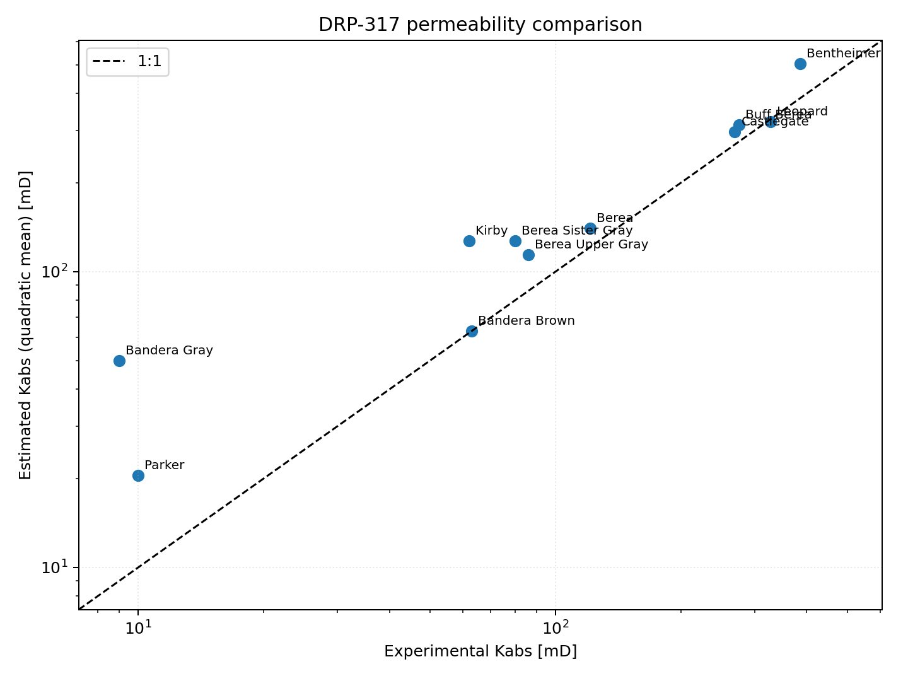
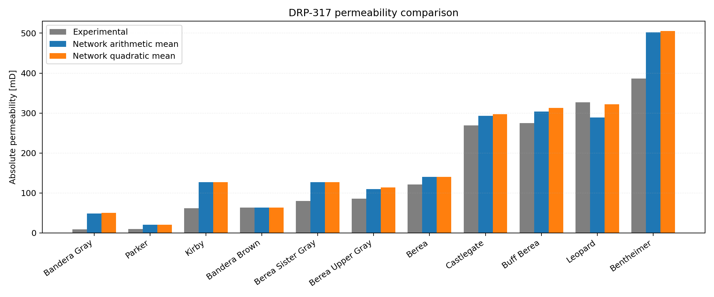

# DRP-317 Sandstone Validation Overview

This report summarizes the current `voids` validation workflow for all eleven
DRP-317 sandstone notebooks:

- `20_mwe_drp317_banderagray_raw_porosity_perm`
- `28_mwe_drp317_parker_raw_porosity_perm`
- `26_mwe_drp317_kirby_raw_porosity_perm`
- `21_mwe_drp317_banderabrown_raw_porosity_perm`
- `22_mwe_drp317_bereasistergray_raw_porosity_perm`
- `23_mwe_drp317_bereauppergray_raw_porosity_perm`
- `18_mwe_drp317_berea_raw_porosity_perm`
- `25_mwe_drp317_castlegate_raw_porosity_perm`
- `24_mwe_drp317_buffberea_raw_porosity_perm`
- `27_mwe_drp317_leopard_raw_porosity_perm`
- `19_mwe_drp317_bentheimer_raw_porosity_perm`

## Sources

- Dataset: Neumann, R., ANDREETA, M., Lucas-Oliveira, E. (2020, October 7).
  *11 Sandstones: raw, filtered and segmented data* [Dataset].
  Digital Porous Media Portal. <https://www.doi.org/10.17612/f4h1-w124>
- Experimental reference paper: Neumann, R. F., Barsi-Andreeta, M., Lucas-Oliveira, E.,
  Barbalho, H., Trevizan, W. A., Bonagamba, T. J., & Steiner, M. B. (2021).
  *High accuracy capillary network representation in digital rock reveals permeability scaling functions*.
  *Scientific Reports, 11*, 11370. <https://doi.org/10.1038/s41598-021-90090-0>

## Current Notebook Setup

All DRP-317 notebooks share the same current modeling choices:

- a porosity-matched coarse ROI scan rather than a fixed centered ROI
- `snow2` extraction through the current PoreSpy backend
- `generic_poiseuille` conductance
- pressure-dependent water viscosity from the `thermo` backend
- absolute outlet pressure `5.0 MPa`
- imposed pressure gradient `10 kPa/m`
- reported aggregate permeability as the quadratic mean across `Kx`, `Ky`, and `Kz`

## Summary Table

The underlying summary CSV is committed as
[`docs/assets/validation/drp317_summary.csv`](../assets/validation/drp317_summary.csv).

| Sample | Notebook | Experimental porosity [%] | Full-image porosity [%] | Network porosity [%] | Experimental permeability [mD] | Quadratic-mean permeability [mD] | Relative permeability error [%] |
|---|---|---:|---:|---:|---:|---:|---:|
| Bandera Gray | `20_mwe_drp317_banderagray_raw_porosity_perm` | 18.10 | 21.03 | 20.70 | 9.0 | 49.97 | 455.20 |
| Parker | `28_mwe_drp317_parker_raw_porosity_perm` | 14.77 | 13.65 | 12.90 | 10.0 | 20.43 | 104.32 |
| Kirby | `26_mwe_drp317_kirby_raw_porosity_perm` | 19.95 | 21.49 | 22.00 | 62.0 | 127.01 | 104.85 |
| Bandera Brown | `21_mwe_drp317_banderabrown_raw_porosity_perm` | 24.11 | 21.18 | 21.25 | 63.0 | 63.12 | 0.18 |
| Berea Sister Gray | `22_mwe_drp317_bereasistergray_raw_porosity_perm` | 19.07 | 19.79 | 20.20 | 80.0 | 127.01 | 58.77 |
| Berea Upper Gray | `23_mwe_drp317_bereauppergray_raw_porosity_perm` | 18.56 | 19.65 | 19.91 | 86.0 | 113.96 | 32.52 |
| Berea | `18_mwe_drp317_berea_raw_porosity_perm` | 18.96 | 21.67 | 21.82 | 121.0 | 139.98 | 15.69 |
| Castlegate | `25_mwe_drp317_castlegate_raw_porosity_perm` | 26.54 | 24.67 | 25.16 | 269.0 | 296.92 | 10.38 |
| Buff Berea | `24_mwe_drp317_buffberea_raw_porosity_perm` | 24.02 | 22.71 | 23.40 | 275.0 | 313.09 | 13.85 |
| Leopard | `27_mwe_drp317_leopard_raw_porosity_perm` | 20.22 | 19.50 | 20.01 | 327.0 | 321.71 | -1.62 |
| Bentheimer | `19_mwe_drp317_bentheimer_raw_porosity_perm` | 22.64 | 26.72 | 27.57 | 386.0 | 505.19 | 30.88 |

## Figures

## Interpretation

Across all eleven samples, the current image-to-network workflow is strongly
case-dependent. Several rocks are close to the experimental permeability scale,
while lower-permeability and strongly heterogeneous cases still show large
errors. The main validation signal remains that extraction representativeness
and flow-limiting geometry dominate the mismatch more than the pressure-aware
viscosity update.

## Sample Reports

- [DRP-317 Bandera Gray notebook report](drp317_banderagray.md)
- [DRP-317 Parker notebook report](drp317_parker.md)
- [DRP-317 Kirby notebook report](drp317_kirby.md)
- [DRP-317 Bandera Brown notebook report](drp317_bandera_brown.md)
- [DRP-317 Berea Sister Gray notebook report](drp317_berea_sister_gray.md)
- [DRP-317 Berea Upper Gray notebook report](drp317_berea_upper_gray.md)
- [DRP-317 Berea notebook report](drp317_berea.md)
- [DRP-317 Castlegate notebook report](drp317_castlegate.md)
- [DRP-317 Buff Berea notebook report](drp317_buff_berea.md)
- [DRP-317 Leopard notebook report](drp317_leopard.md)
- [DRP-317 Bentheimer notebook report](drp317_bentheimer.md)
