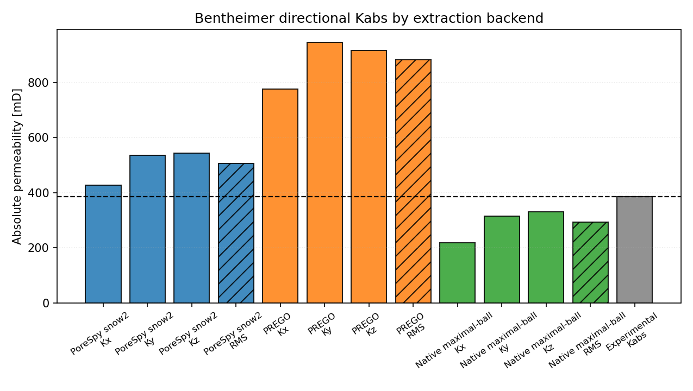

# DRP-317 Bentheimer Notebook Report

Notebook: `19_mwe_drp317_bentheimer_raw_porosity_perm`

## Sources

- Dataset: Neumann, R., ANDREETA, M., Lucas-Oliveira, E. (2020, October 7).
  *11 Sandstones: raw, filtered and segmented data* [Dataset].
  Digital Porous Media Portal. <https://www.doi.org/10.17612/f4h1-w124>
- Experimental reference paper: Neumann, R. F., Barsi-Andreeta, M., Lucas-Oliveira, E.,
  Barbalho, H., Trevizan, W. A., Bonagamba, T. J., & Steiner, M. B. (2021).
  *High accuracy capillary network representation in digital rock reveals permeability scaling functions*.
  *Scientific Reports, 11*, 11370. <https://doi.org/10.1038/s41598-021-90090-0>

## Current Setup

- Raw volume: `Bentheimer_2d25um_binary.raw`
- ROI size: `(300, 300, 300)` voxels
- Selected ROI origin: `(0, 0, 700)`
- ROI porosity: `26.75%`
- Extraction backends: `porespy`, `prego`, `native_maximal_ball`
- Conductance model: `generic_poiseuille`
- Viscosity model: tabulated water viscosity from `thermo`, `298.15 K`
- Boundary pressures: `pout = 5.0 MPa`, `pin = pout + 10 kPa/m * L`

## Key Results

| Quantity | Value |
|---|---:|
| Experimental porosity [%] | 22.64 |
| Full-image porosity [%] | 26.72 |
| ROI porosity [%] | 26.75 |
| Experimental permeability [mD] | 386.0 |

| Backend | Network phi [%] | Kx [mD] | Ky [mD] | Kz [mD] | RMS K [mD] | Rel. K error [%] | Np | Nt |
|---|---|---:|---:|---:|---:|---:|---:|---:|
| PoreSpy snow2 | 27.57 | 426.82 | 536.39 | 543.85 | 505.19 | 30.88 | 2625 | 4639 |
| PREGO | 26.53 | 775.18 | 945.29 | 915.94 | 881.93 | 128.48 | 1444 | 3643 |
| Native maximal-ball | 26.53 | 218.22 | 315.43 | 330.66 | 292.38 | -24.25 | 1126 | 2130 |

## Network Statistics Snapshot

| Backend | Mean coordination | Dead-end pore fraction |
|---|---:|---:|
| PoreSpy snow2 | 3.53 | 0.337 |
| PREGO | 5.05 | 0.063 |
| Native maximal-ball | 3.78 | 0.219 |

## Interpretation

For `Bentheimer`, the closest aggregate permeability in this rerun is
from `Native maximal-ball` with a relative permeability error of
`-24.25%`. The spread between the
largest and smallest backend aggregate permeability is about `3.02`x,
which makes extraction sensitivity a material part of this sample's validation
result.

This is a reduced-network comparison against a laboratory-scale experimental
reference. The numbers depend on the selected ROI, segmentation convention,
boundary labeling, network reduction, and conductance closure; they should not be
read as a direct voxel-scale flow simulation.
