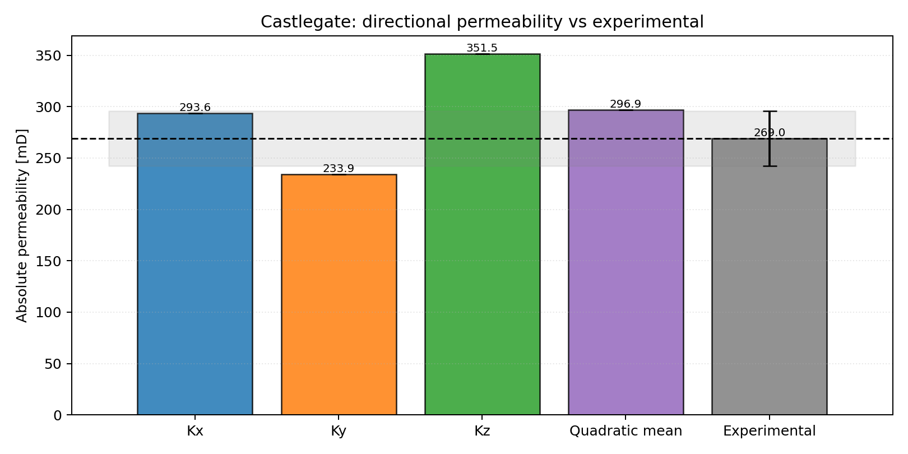

# DRP-317 Castlegate Notebook Report

Notebook: `25_mwe_drp317_castlegate_raw_porosity_perm`

## Sources

- Dataset: Neumann, R., ANDREETA, M., Lucas-Oliveira, E. (2020, October 7).
  *11 Sandstones: raw, filtered and segmented data* [Dataset].
  Digital Porous Media Portal. <https://www.doi.org/10.17612/f4h1-w124>
- Experimental reference paper: Neumann, R. F., Barsi-Andreeta, M., Lucas-Oliveira, E.,
  Barbalho, H., Trevizan, W. A., Bonagamba, T. J., & Steiner, M. B. (2021).
  *High accuracy capillary network representation in digital rock reveals permeability scaling functions*.
  *Scientific Reports, 11*, 11370. <https://doi.org/10.1038/s41598-021-90090-0>

## Current Setup

- Raw volume: `CastleGate_2d25um_binary.raw`
- ROI size: `300 x 300 x 300` voxels
- Selected ROI origin: `(0, 0, 350)`
- Conductance model: `generic_poiseuille`
- Viscosity model: tabulated water viscosity from `thermo`, `298.15 K`
- Boundary pressures: `pout = 5.0 MPa`, `pin = pout + 10 kPa/m * L`

## Key Results

| Quantity | Value |
|---|---:|
| Experimental porosity [%] | 26.54 |
| Full-image porosity [%] | 24.67 |
| ROI porosity [%] | 24.56 |
| Network absolute porosity [%] | 25.16 |
| Experimental permeability [mD] | 269.0 |
| Kx [mD] | 293.61 |
| Ky [mD] | 233.93 |
| Kz [mD] | 351.50 |
| Arithmetic mean permeability [mD] | 293.01 |
| Quadratic-mean permeability [mD] | 296.92 |
| Relative quadratic-mean error [%] | 10.38 |

## Interpretation

The current workflow predicts `Castlegate` with a quadratic-mean permeability error of
`10.38%` relative to the Table 1 experimental reference.
This case should be interpreted together with the cross-sample summary in
[DRP-317 sandstone validation overview](drp317.md).
