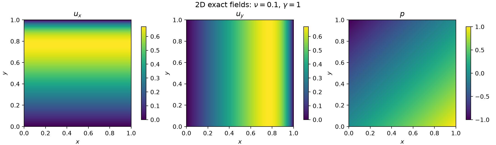
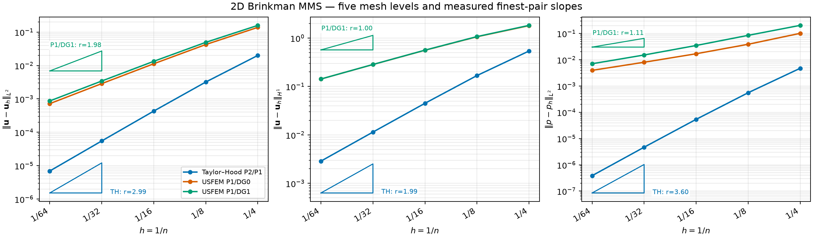

# Two-Dimensional Brinkman MMS Report

This report verifies the three shipped mixed finite-element formulations
against one known, smooth solution. It is a **software-verification** case:
the forcing is chosen to make the prescribed fields exact. It is not evidence
that a porous-medium closure is physically valid.

## Strong problem and exact fields

On \(\Omega=(0,1)^2\), solve

\[
-\nu\Delta\mathbf u+\gamma\mathbf u+\nabla p=\mathbf f,\qquad
\nabla\cdot\mathbf u=0,
\]

with \(\nu=0.1\), \(\gamma=1\), and

\[
g(s)=s-\frac{\exp((s-1)/\nu)-\exp(-1/\nu)}
                 {1-\exp(-1/\nu)},\qquad
\mathbf u_{\rm ex}=(g(y),g(x)),\qquad p_{\rm ex}=x-y.
\]

Because the first velocity component depends only on \(y\) and the second only
on \(x\), \(\nabla\cdot\mathbf u_{\rm ex}=0\) exactly. `voids` constructs

\[
\mathbf f=-\nu\Delta\mathbf u_{\rm ex}
          +\gamma\mathbf u_{\rm ex}+\nabla p_{\rm ex}
\]

as a UFL expression. The complete-boundary condition is
\(\mathbf u=\mathbf u_{\rm ex}\) on \(\partial\Omega\). Pressure has no
physical point gauge; before measuring its error, the mean of
\(p_h-p_{\rm ex}\) is removed.



The exponential layers at \(x=1\) and \(y=1\) test whether the mesh sequence
has reached the asymptotic range. The gentler \(\nu=0.1\) case is used here so
that all five meshes resolve the layer; the reference \(\nu=0.01\) case needs a
substantially finer terminal mesh.

## Discretizations and measured errors

The study compares Taylor--Hood
\([\mathrm{CG}_2]^2\times\mathrm{CG}_1\), USFEM
\([\mathrm{CG}_1]^2\times\mathrm{DG}_0\), and USFEM
\([\mathrm{CG}_1]^2\times\mathrm{DG}_1\). The USFEM runs use physical
interior-edge length (`facet_size_mode="facet_diameter"`). Errors are

\[
e_u^{L^2}=\|\mathbf u_{\rm ex}-\mathbf u_h\|_{L^2},\quad
e_u^{H^1}=\|\mathbf u_{\rm ex}-\mathbf u_h\|_{H^1},\quad
e_p^{L^2}=\|p_{\rm ex}-p_h-c_h\|_{L^2}.
\]

The five structured triangulations have
\(n=(4,8,16,32,64)\), \(h=1/n\), and
\((32,128,512,2048,8192)\) cells. Every marker below is one completed solve.
Each right triangle uses the two finest \(h\) values; its annotation is the
measured slope
\(r=\log(e_{i-1}/e_i)/\log(h_{i-1}/h_i)\), not an imposed guide line.



| Method | \(r(L^2_u)\) | \(r(H^1_u)\) | \(r(L^2_p)\) | Finest \(L^2_u\) | Finest \(L^2_p\) |
|---|---:|---:|---:|---:|---:|
| Taylor--Hood P2/P1 | 2.992 | 1.993 | 3.600 | \(6.924\,10^{-6}\) | \(3.858\,10^{-7}\) |
| USFEM P1/DG0 | 1.994 | 0.995 | 1.024 | \(7.199\,10^{-4}\) | \(3.944\,10^{-3}\) |
| USFEM P1/DG1 | 1.985 | 0.997 | 1.107 | \(8.668\,10^{-4}\) | \(7.030\,10^{-3}\) |

The velocity orders recover the nominal \(3/2\) Taylor--Hood and \(2/1\)
linear-element behavior. Both USFEM pressure rates recover first order.
Taylor--Hood pressure is superconvergent for this mesh/case pairing; that
observed \(3.60\) must not be generalized into a nominal P1-pressure theorem.
The complete machine-readable table is
[available as CSV](../assets/mms/mms_2d_convergence.csv).

## Executable MWE

The full script is
[`examples/fem_mms/mms_2d.py`](https://github.com/geomech-project/voids/blob/main/examples/fem_mms/mms_2d.py).
It performs all 15 solves, asserts the rate thresholds, writes the CSV, and
recreates both figures:

```bash
pixi run python examples/fem_mms/mms_2d.py \
  --output-dir examples/outputs/fem_mms/2d
```

Change viscosity, reaction, mesh sequence, and solver options near the top of
`main`. A rate failure on a deliberately coarse or sharp-layer sequence is a
diagnostic to refine the mesh, not by itself proof of a formulation defect.
