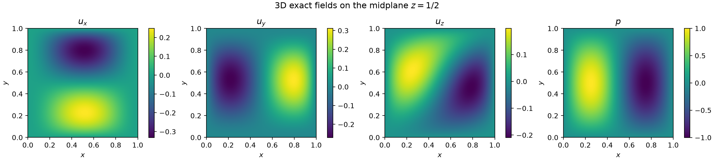
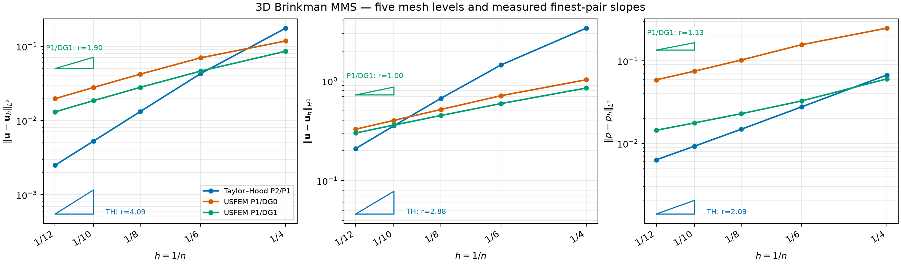

# Three-Dimensional Brinkman MMS Report

The 3D manufactured case exercises tetrahedral assembly, vector derivatives,
pressure stabilization, and the triangular-facet coefficient independently of
the 2D implementation.

## Exact divergence-free solution

On \(\Omega=(0,1)^3\), let

\[
B=x^2(1-x)^2y^2(1-y)^2z^2(1-z)^2,\qquad
\phi=32B(1+x+2y+3z),
\]

\[
\mathbf u_{\rm ex}=
\begin{bmatrix}
3\phi_y-2\phi_z\\
\phi_z-3\phi_x\\
2\phi_x-\phi_y
\end{bmatrix},\qquad
p_{\rm ex}=\sin(2\pi x)\sin(\pi y)\sin(\pi z).
\]

The mixed derivatives cancel in \(\nabla\cdot\mathbf u_{\rm ex}\), and the
bubble makes velocity zero on all six faces. With \(\nu=10^{-2}\) and
\(\gamma=1\), `voids` manufactures the same strong residual as in the
[2D report](mms_2d.md). The exact velocity is imposed on the complete
boundary, and pressure error is compared modulo its mean.



The image is a \(z=1/2\) section through the analytic 3D functions; it is an
illustration, not a sampled finite-element result.

## Five-level convergence study

The meshes use \(n=(4,6,8,10,12)\) subdivisions per direction and contain
\((384,1296,3072,6000,10368)\) tetrahedra. Taylor--Hood, P1/DG0 USFEM, and
P1/DG1 USFEM are compared on the identical mesh sequence. The USFEM report
profile uses `facet_size_mode="representative"`, hence
\(h_F=\sqrt{2}/n\), and a 24-level reference-face solve for `face3d`.



| Method | \(r(L^2_u)\) | \(r(H^1_u)\) | \(r(L^2_p)\) | Finest \(L^2_u\) | Finest \(L^2_p\) |
|---|---:|---:|---:|---:|---:|
| Taylor--Hood P2/P1 | 4.088 | 2.884 | 2.088 | \(2.498\,10^{-3}\) | \(6.313\,10^{-3}\) |
| USFEM P1/DG0 | 1.901 | 1.121 | 1.326 | \(1.968\,10^{-2}\) | \(5.894\,10^{-2}\) |
| USFEM P1/DG1 | 1.901 | 1.004 | 1.131 | \(1.307\,10^{-2}\) | \(1.441\,10^{-2}\) |

Each curve contains five live solves and each triangle reports a measured
finest-pair slope. The two linear-velocity formulations recover approximately
second-order \(L^2\) and first-order \(H^1\) behavior. Taylor--Hood is
superconvergent in velocity for this symmetric polynomial case; the nominal
portable expectation remains \(3/2/2\), not \(4/3/2\). The raw table is
[available as CSV](../assets/mms/mms_3d_convergence.csv).

The 3D `face3d` law comes from a numerical reference-triangle subproblem. Its
observed convergence is evidence for the implemented structured-tetrahedron
study, not a general stability proof for arbitrary anisotropic tetrahedra.
The presentation-replication profiles additionally provide the longer
\((4,6,8,10,12,16,20)\) sequence for report-value regression.

## Executable MWE

[`examples/fem_mms/mms_3d.py`](https://github.com/geomech-project/voids/blob/main/examples/fem_mms/mms_3d.py)
recreates the five-level table, analytic section, convergence plot, and rate
assertions:

```bash
pixi run python examples/fem_mms/mms_3d.py \
  --output-dir examples/outputs/fem_mms/3d
```

The terminal \(12^3\) Taylor--Hood and P1/DG1 direct solves are intentionally
nontrivial. For fast smoke testing, shorten the sequence; do not present the
resulting coarse slopes as the documented convergence study.
