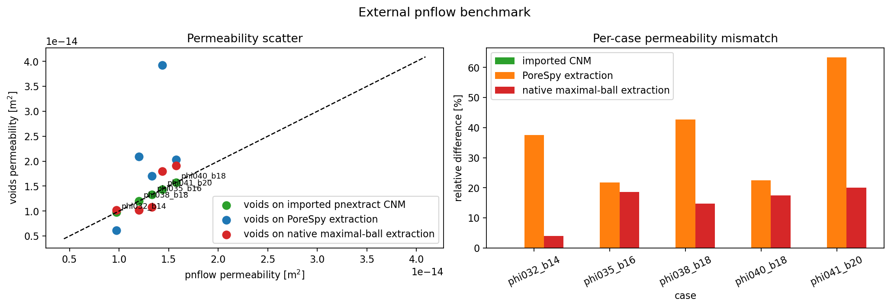
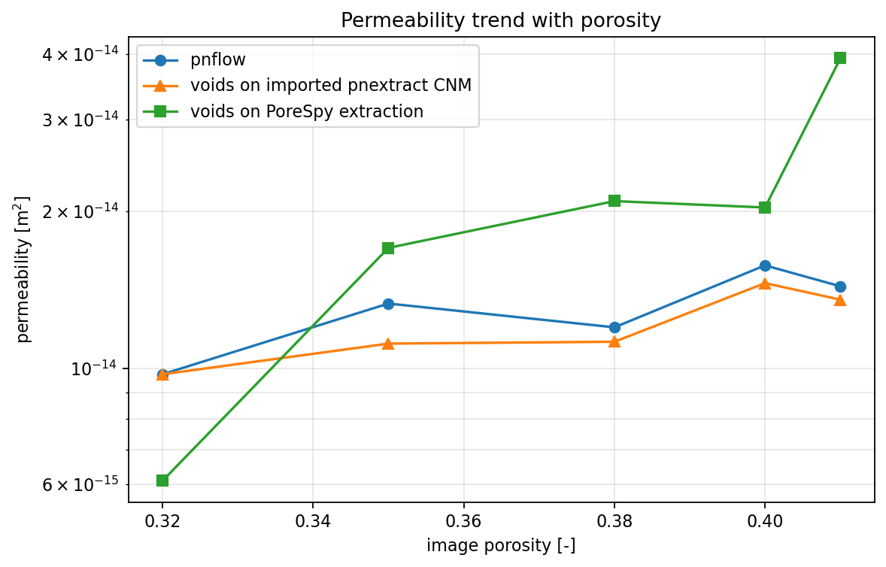

# External `pnextract` / `pnflow` Benchmark

This report documents a controlled verification study of `voids` against a
fixed external reference dataset generated with the Imperial College
`pnextract` + `pnflow` workflow. Unlike the OpenPNM cross-check, this
comparison does **not** share the same extracted network or the same transport
closure across both sides.

That difference is exactly why this study is useful: it measures the full gap
between the current `voids` image-to-network workflow and an independent
external PNM workflow on the same binary input volumes.

The reproducible artifact for this report is notebook
`notebooks/15_mwe_external_pnflow_benchmark.ipynb`.

---

## Goal

The benchmark answers the following question:

Given the same binary segmented volume, how different is the apparent
permeability predicted by:

1. `voids` after `snow2` extraction and single-phase PNM solution, and
2. a saved external reference built from `pnextract` network extraction plus
   `pnflow` transport simulation?

This is a workflow-level comparison. A mismatch is not automatically a `voids`
bug, because the two sides differ in:

- extracted topology
- pore and throat geometry assignment
- constitutive closure
- single-phase solver implementation

---

## Governing Formulations

### `voids` PNM Workflow

For each committed binary volume, `voids`:

1. extracts a pore network with `snow2`
2. prunes to the `x`-spanning subnetwork
3. solves the steady graph pressure system

$$
\mathbf{A}\,\mathbf{p} = \mathbf{b},
$$

with throat fluxes

$$
q_t = g_t (p_i - p_j),
$$

and apparent permeability from Darcy's law

$$
K = \frac{|Q|\,\mu\,L}{A\,|\Delta p|}.
$$

For this benchmark, the `voids` side uses:

- `conductance_model = "valvatne_blunt"`
- `solver = "direct"`
- $\mu = 1.0 \times 10^{-3}$ Pa s

### External `pnextract` / `pnflow` Reference

The reference data committed in `examples/data/external_pnflow_benchmark/`
were generated earlier by:

1. exporting the binary image to MetaImage format
2. extracting a network with `pnextract`
3. running `pnflow` on the resulting `*_node*.dat` / `*_link*.dat` files
4. recording the upscaled permeability and porosity from `*_upscaled.tsv`

The current notebook does not rerun those binaries. It reads the committed
reference outputs instead. That is an intentional reproducibility choice: the
benchmark remains runnable even if `pnextract` or `pnflow` are unavailable in
future environments.

Scientifically, the correct statement is:

- the benchmark compares `voids` against a fixed external workflow reference
- it does **not** re-verify future upstream `pnextract` / `pnflow` revisions
- it does **not** isolate solver differences from extraction-model differences

---

## Fixed Reference Dataset

The committed reference bundle lives in
`examples/data/external_pnflow_benchmark/` and includes:

- `manifest.csv` with case metadata and file paths
- exact binary benchmark volumes as `void_volume.npy`
- saved `pnflow` reports (`*_pnflow.prt`, `*_upscaled.tsv`)
- saved extracted-network files (`*_node*.dat`, `*_link*.dat`)

This design matters because it makes the benchmark stable against future
changes in:

- the random generator implementation
- local build details of the external codes
- availability of the external binaries

All cases in this report use:

- shape `(32, 32, 32)`
- flow axis `x`
- voxel size `2.0e-6 m`
- fluid viscosity `1.0e-3 Pa s`

The five-case set is:

| Case | Target porosity | Blobiness | Seed used |
|---|---:|---:|---:|
| `phi032_b14` | 0.32 | 1.4 | 401 |
| `phi035_b16` | 0.35 | 1.6 | 501 |
| `phi038_b18` | 0.38 | 1.8 | 601 |
| `phi040_b18` | 0.40 | 1.8 | 901 |
| `phi041_b20` | 0.41 | 2.0 | 701 |

---

## Why The Two Methods Differ

Even when both workflows are implemented correctly, they are not solving the
same reduced model.

| Aspect | `voids` | External reference |
|---|---|---|
| Input geometry | Same committed binary image | Same committed binary image |
| Extraction backend | `snow2` | `pnextract` |
| Unknowns | One pressure unknown per retained pore | `pnflow` network unknowns on `pnextract` output |
| Conductance closure | `valvatne_blunt` conduit model | `pnflow` internal network model |
| Main approximation | Image-to-network reduction plus chosen conductance closure | Independent image-to-network reduction plus independent closure |

Therefore, disagreement here is expected to be much larger than in the
OpenPNM cross-check. That larger spread is the signal this benchmark is meant
to expose.

---

## Figures

Left: `voids` permeability against the saved `pnflow` permeability with the
identity line. Right: per-case relative difference.

Porosity-permeability trend for the five committed benchmark cases. This is
useful for checking whether `voids` and the external reference follow the same
macroscopic trend even when the pointwise values differ.

---

## Results

The full CSV generated by the notebook is available here:
[pnflow_5_case_results.csv](../assets/verification/pnflow_5_case_results.csv).

| Case | `K_voids` [m^2] | `K_pnflow` [m^2] | `K_voids / K_pnflow` | Rel. diff. [%] | `Np_voids` / `Np_pnflow` | `Nt_voids` / `Nt_pnflow` |
|---|---:|---:|---:|---:|---:|---:|
| `phi032_b14` | `6.097e-15` | `9.752e-15` | `0.625` | `37.48` | `53 / 80` | `150 / 202` |
| `phi035_b16` | `1.702e-14` | `1.332e-14` | `1.278` | `21.76` | `26 / 71` | `79 / 198` |
| `phi038_b18` | `2.092e-14` | `1.199e-14` | `1.744` | `42.67` | `36 / 64` | `106 / 180` |
| `phi040_b18` | `2.033e-14` | `1.576e-14` | `1.291` | `22.51` | `45 / 83` | `134 / 280` |
| `phi041_b20` | `3.926e-14` | `1.437e-14` | `2.732` | `63.40` | `37 / 72` | `106 / 247` |

Summary statistics for this five-case set:

- mean relative permeability difference: `37.56 %`
- minimum relative permeability difference: `21.76 %`
- maximum relative permeability difference: `63.40 %`
- `voids` returns fewer pores than the external reference on every case
- `voids` returns fewer throats than the external reference on every case
- `voids` absolute-network porosity exceeds the saved `pnflow` porosity by
  about `0.044` to `0.064` in absolute porosity units across these five cases

Those last two points are important: a large part of the permeability gap is
consistent with the two workflows constructing materially different reduced
networks from the same voxel images.

---

## Interpretation

These results support the following conclusions:

1. The current `voids` workflow is not interchangeable with this external
   `pnextract` / `pnflow` reference on the tested morphologies.
2. The disagreement is morphology-sensitive: some cases differ by about
   `22 %`, while the worst case here differs by about `63 %`.
3. The systematic pore/throat count gap suggests that extraction topology and
   geometric reduction, not only linear-solver differences, are contributing
   materially to the permeability mismatch.
4. The porosity-permeability trend remains broadly monotone across both
   methods, so the benchmark indicates partial qualitative consistency even
   where pointwise agreement is limited.

The practical interpretation is that this benchmark is useful as an external
workflow reference, but it should be read as a comparison between two different
reduced-order models, not as a pass/fail unit test.

---

## Limits Of This Verification

This report is intentionally narrow.

Important limits and assumptions:

- the reference is a committed saved dataset, not a rerun of the latest
  upstream `pnextract` / `pnflow` source tree
- the cases are small synthetic volumes, not real rocks
- the benchmark does not isolate extraction from constitutive-model effects
- the external reference was generated on one specific local build path, so it
  should be treated as a fixed comparison baseline
- agreement here does not imply agreement with direct-image references such as
  XLB
