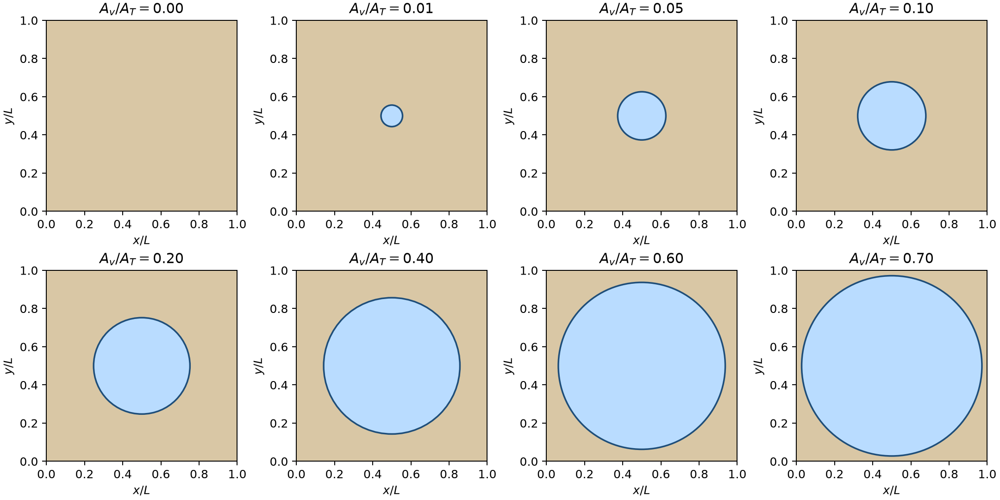
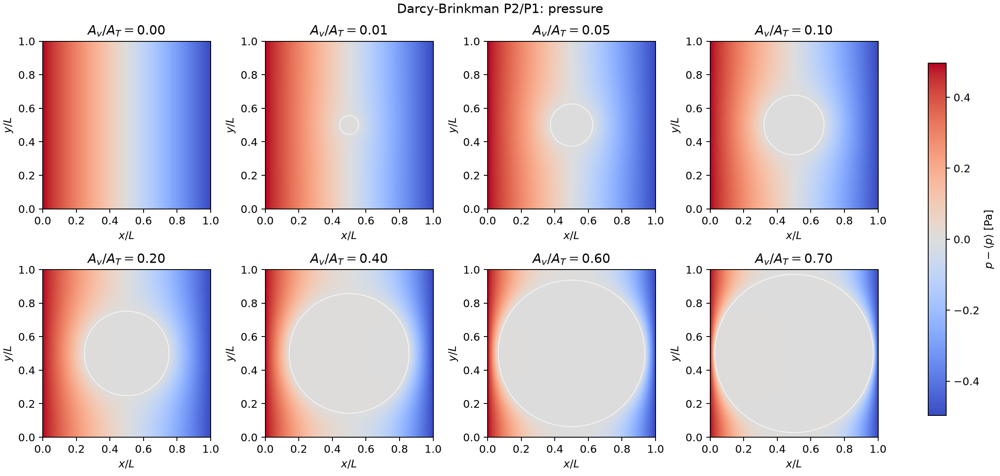
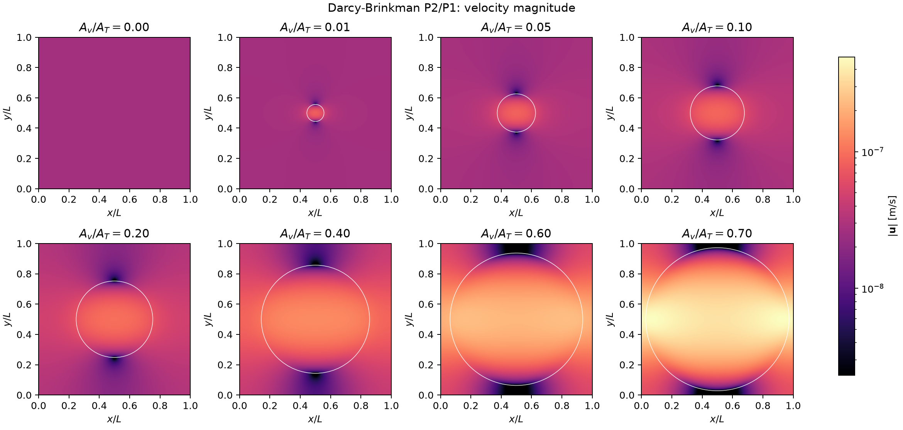
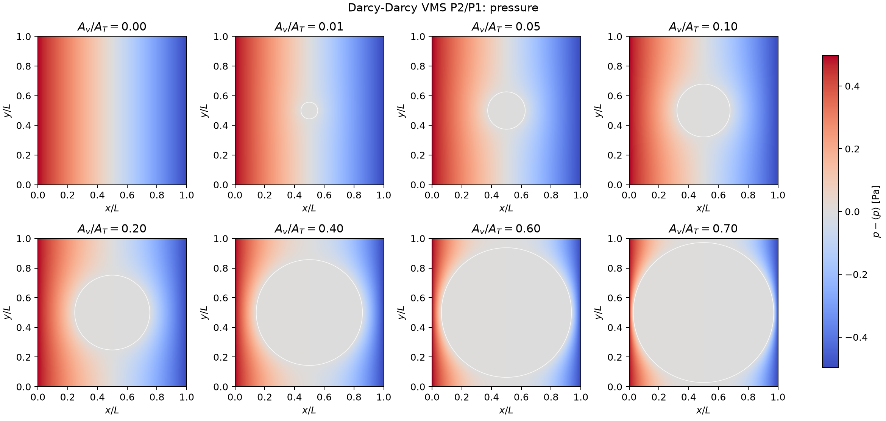
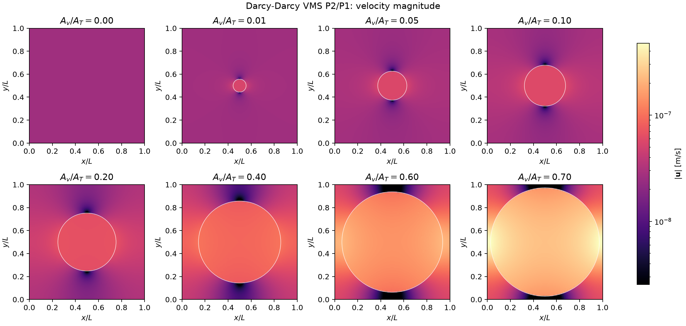
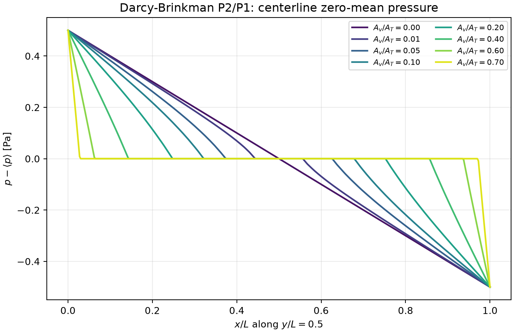
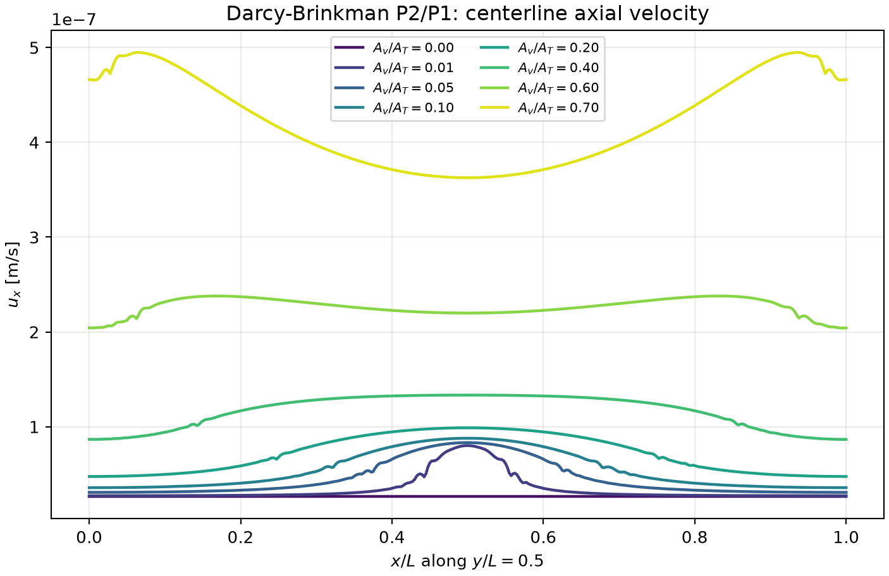
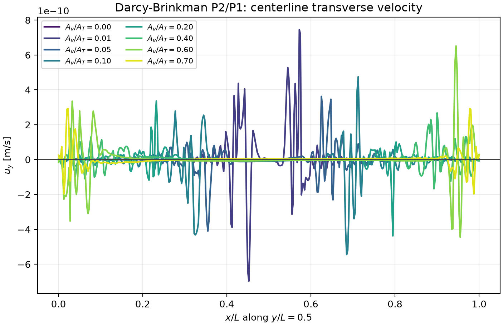
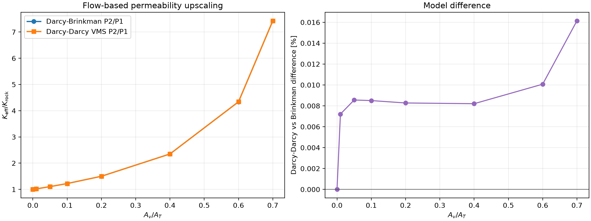

# Two-Dimensional Body-Fitted Vug Report

This is a synthetic **benchmark with no known exact flow field**, not MMS.
It tests geometry construction, coefficient partitioning, boundary conditions,
field behavior, and flow-based upscaling for a controlled centered vug family.

## Physical case family

A \(500^2\)-voxel image with \(15\,\mu\mathrm m\) voxels defines a
\(L=7.5\,\mathrm{mm}\) square. The porous matrix has
\(\phi_m=0.2\), \(K_m=200\,\mathrm{mD}=1.9738466\,10^{-13}\,\mathrm m^2\),
and \(\mu=10^{-3}\,\mathrm{Pa\,s}\). A centered circle represents
\(f_v=(0,0.01,0.05,0.1,0.2,0.4,0.6,0.7)\), with

\[
r=L\sqrt{f_v/\pi}.
\]

The \(f_v=0\) member is matrix only. The \(f_v=0.7\) circle remains contained;
the strict geometric upper limit is \(\pi/4\).



Gmsh fragments the circle and square, preserving matrix, vug, exterior, and
interface tags. The nominal resolution is 100, producing about 11,800 nearly
uniform triangles per case; there is no intentional interface refinement.

## Models, weak forms, and boundary conditions

Let \(V_h=[\mathrm{CG}_2]^2\), \(Q_h=\mathrm{CG}_1\). Both branches use
\(p_L=1\,\mathrm{Pa}\), \(p_R=0\), so \(\Delta p=1\,\mathrm{Pa}\).
Natural pressure traction is applied on left/right. The top and bottom impose
zero normal velocity and natural tangential traction.

For Darcy--Brinkman, find \((\mathbf u_h,p_h)\in V_h\times Q_h\) such that

\[
(\nu_{\rm eff}\nabla\mathbf u_h,\nabla\mathbf v)
+(\gamma_B\mathbf u_h,\mathbf v)
-(p_h,\nabla\cdot\mathbf v)+(q,\nabla\cdot\mathbf u_h)
=\ell_p(\mathbf v),
\]

\[
\nu_{\rm eff}=
\begin{cases}\mu/\phi_m&\Omega_m,\\ \mu&\Omega_v,\end{cases}
\qquad
\gamma_B=
\begin{cases}\mu/K_m&\Omega_m,\\ 0&\Omega_v.\end{cases}
\]

The vug reaction is exactly zero. No artificial vug permeability is used in
this Brinkman branch.

The Darcy--Darcy VMS branch omits diffusion and uses
\(\gamma_D=\mu/K_m\) in the matrix and \(\mu/K_v\) in the vug, with
configurable \(K_v=10^{-8}\,\mathrm m^2\). Its additional residual term is

\[
\frac12(-\gamma_D\mathbf v+\nabla q,\,
\tau_M(\gamma_D\mathbf u_h+\nabla p_h)),\qquad
\tau_M=\min(C_Mh^2/\mu,C_M/\gamma_D),\quad C_M=1.
\]

\(K_v\) is a numerical free-flow closure for Darcy--Darcy, not a measured
intrinsic permeability of an open cavity.

## Pressure and velocity fields

All panels below are completed finite-element solves. The pressure shown is
shifted to zero domain mean after solving; pressure differences and fluxes are
unchanged.









The horizontal midline \(y=L/2\) exposes components that a magnitude plot can
hide:







Symmetry predicts \(u_y=0\) on this line. The plotted transverse values remain
below \(8\,10^{-10}\,\mathrm{m\,s^{-1}}\), roughly two orders below the vug
through-flow scale; their jagged appearance is point-sampling and discrete
symmetry noise magnified by the narrow vertical axis, not a resolved secondary
circulation.

## Flow-based upscaling

\[
K_{\rm eff}=\frac{\mu L\,Q}{A\,\Delta p}.
\]

In 2D, \(Q\) and \(A=L\) are per unit out-of-plane depth. Selected results are:

| \(f_v\) | \(K_{\rm eff}/K_m\), Brinkman | \(K_{\rm eff}/K_m\), Darcy--Darcy VMS |
|---:|---:|---:|
| 0.00 | 1.0000 | 1.0000 |
| 0.10 | 1.2220 | 1.2221 |
| 0.40 | 2.3504 | 2.3506 |
| 0.60 | 4.3402 | 4.3406 |
| 0.70 | 7.4276 | 7.4288 |



Agreement between these two parameter choices is a formulation comparison,
not proof that \(K_v=10^{-8}\,\mathrm m^2\) is unique or physical. The full
results and represented fractions are
[available as CSV](../assets/mms/vug_2d_summary.csv).

## Executable MWE and notebook

The compact script
[`examples/fem_mms/vug_2d.py`](https://github.com/geomech-project/voids/blob/main/examples/fem_mms/vug_2d.py)
solves four representative fractions and writes field galleries:

```bash
pixi run python examples/fem_mms/vug_2d.py --resolution 40
```

Use `--full-family --resolution 100 --export-xdmf` for the eight-case
report configuration and ParaView output.

The research notebook
[`53_mwe_body_fitted_2d_centered_vug_upscaling.ipynb`](https://github.com/geomech-project/voids/blob/main/notebooks/53_mwe_body_fitted_2d_centered_vug_upscaling.ipynb)
runs all eight fractions at resolution 100, plots every pressure and velocity
field and the three centerline quantities, performs a 70% mesh-sensitivity
check, and exports XDMF/HDF5 files for ParaView.

The matrix screening length \(\sqrt{K_m/\phi_m}\approx1\,\mu\mathrm m\) is
much smaller than the nominal \(106\,\mu\mathrm m\) triangle diameter.
Therefore the integral permeability comparison is meaningful here, while the
pointwise interface layer is not claimed mesh-resolved.
