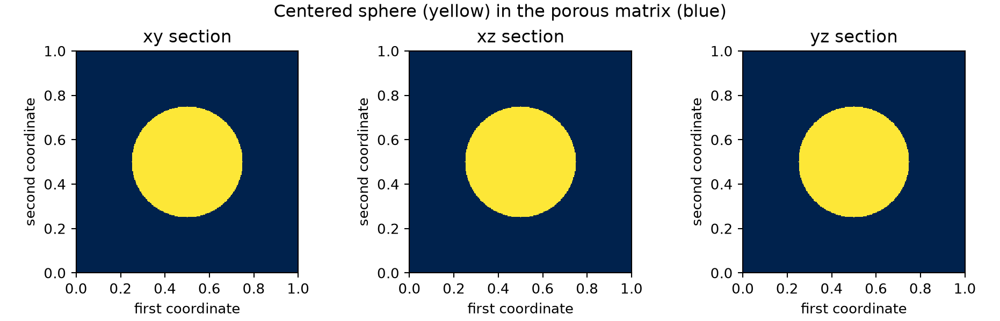
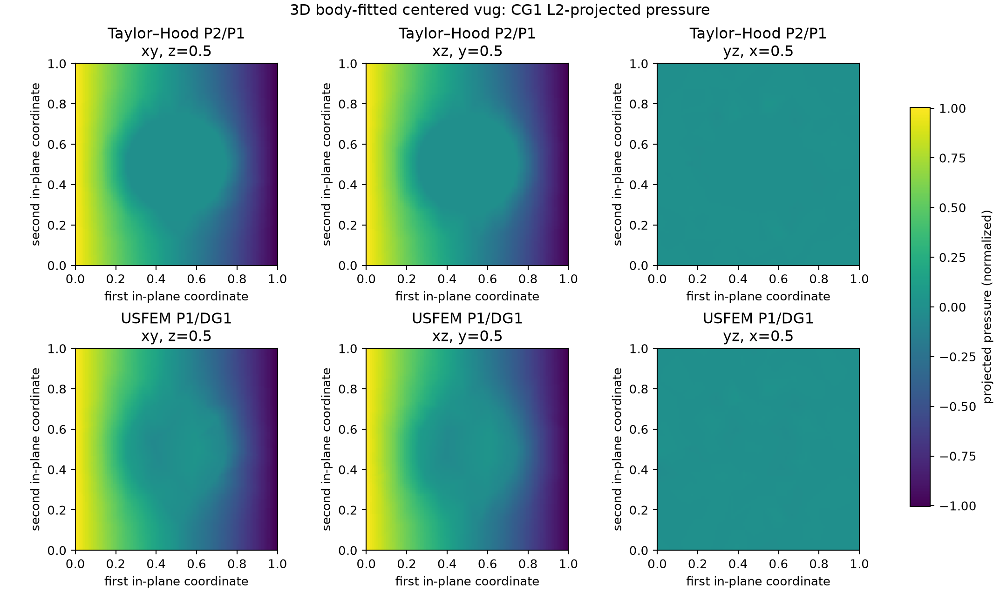
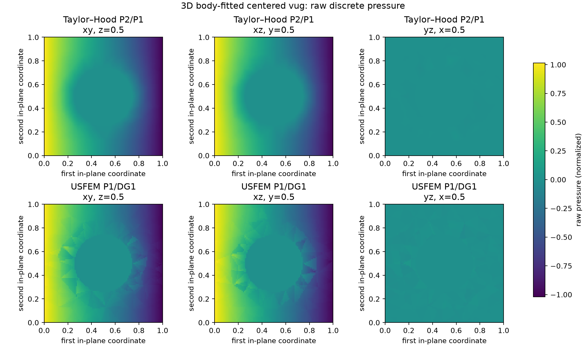
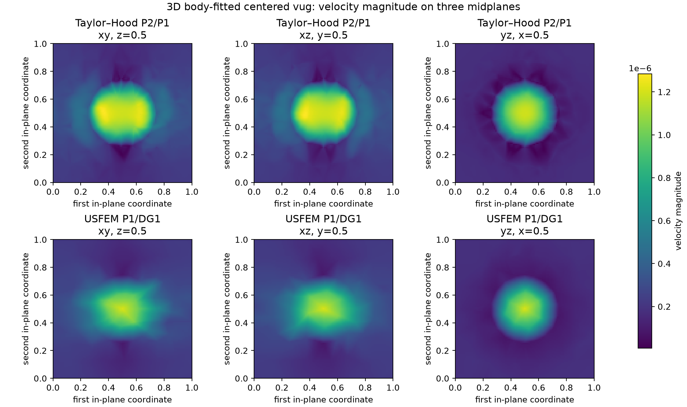
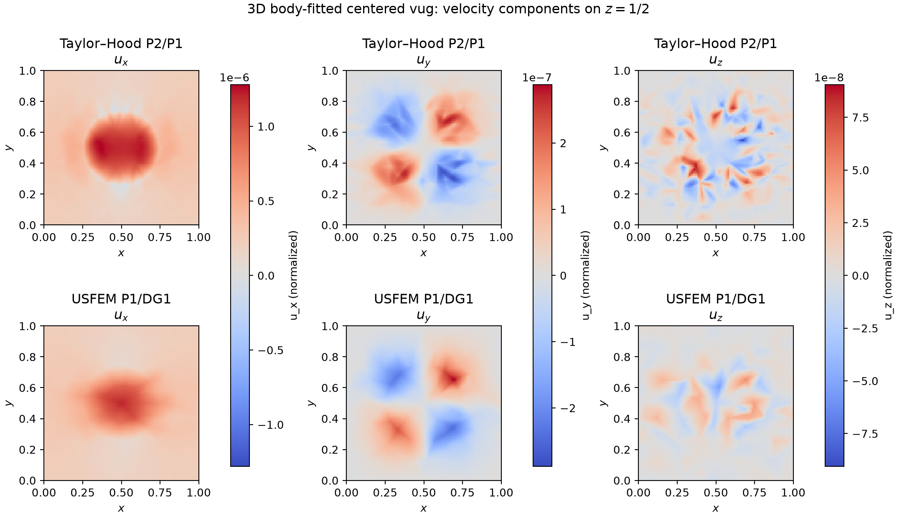
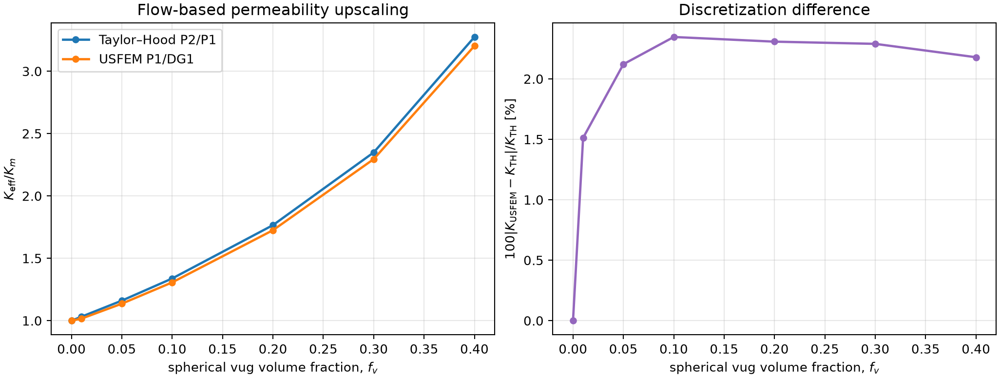

# Three-Dimensional Body-Fitted Vug Verification

This page documents a body-fitted spherical FEM benchmark for pressure,
velocity, and flow-based upscaling. It has no known exact flow solution, so it
is a synthetic verification benchmark rather than MMS.

## Body-fitted FEM flow benchmark

The spherical benchmark and its volume-fraction sweep are the 3D counterparts of the
[2D body-fitted family](vug_2d.md). Its role is formulation parity,
flow-based upscaling, geometry/provenance checking, and report-value regression.

### Geometry and coefficients

The unit cube contains a centered sphere of radius \(r=0.25\). Its analytic
volume fraction is

\[
f_v=\frac{4\pi r^3}{3}=0.0654498.
\]

The nondimensional benchmark uses
\(\nu=10^{-2}\), \(\gamma_m=10^7\), \(\gamma_v=1\),
\(p_L=1\), and \(p_R=-1\). Natural pressure traction acts at \(x=0,1\);
the four transverse walls impose zero normal velocity. Gmsh fragments the
cube and sphere and transfers physical volume, exterior, and interface tags.



### Formulation comparison and field sections

The gallery compares Taylor--Hood P2/P1 with P1/DG1 USFEM on the same
body-fitted mesh. The USFEM branch uses the shifted 3D facet law and
`facet_size_mode="facet_measure"`, namely \(\sqrt{|F|}\) for a triangular
facet. That is a measure-based length, not an exact diameter for an arbitrary
triangle.



Taylor--Hood pressure is continuous, whereas the USFEM pressure space is
\(\mathrm{DG}_1\). For the comparison above, each raw pressure is projected
onto continuous CG1 by the \(L^2\) problem

\[
(\widetilde p_h,w_h)=(p_h,w_h)
\qquad\forall w_h\in\mathrm{CG}_1.
\]

This changes only the visualization field: flux, permeability, and the
reported solve all use the unmodified discrete pressure. The raw DG1 result is
shown below as a diagnostic; its triangular element-to-element jumps are an
expected property of the discontinuous pressure space and must not be hidden
or mistaken for the projected field.



A focused P1/DG1 refinement check gives:

| Nominal resolution | Tetrahedra | \(\|[p_h]\|_{L^2(\mathcal F_h)}\) | Outlet flux |
|---:|---:|---:|---:|
| 8 | 834 | 0.37295 | \(2.24249\,10^{-7}\) |
| 12 | 1,968 | 0.33548 | \(2.31423\,10^{-7}\) |
| 16 | 5,018 | 0.22761 | \(2.37442\,10^{-7}\) |

The raw jump diagnostic decreases with refinement while the flux approaches
the report-scale value. This supports the interpretation that the faceting is
a coarse-mesh DG visualization effect, rather than evidence that a continuous
pressure was assembled incorrectly. The three meshes are not a sufficient
asymptotic sequence for assigning a jump-convergence rate.





Pressure is shifted to zero volume mean only after the solve. Each pressure
gallery uses common color limits across methods. These resolution-16 sections are
a qualitative field and implementation audit, not the report-scale flux
result. The exact cell count, represented fraction, flux, and timings are
[available as CSV](../assets/mms/vug_3d_summary.csv).

| Resolution-16 method | Tetrahedra | Represented \(f_v\) | Outlet flux |
|---|---:|---:|---:|
| Taylor--Hood P2/P1 | 5,018 | 0.06193 | \(2.42981\,10^{-7}\) |
| USFEM P1/DG1 | 5,018 | 0.06193 | \(2.37442\,10^{-7}\) |

The USFEM/Taylor--Hood flux ratio is \(0.9772\). The remaining 2.28% mismatch,
and the visible local field differences, are reasons to retain the finer
report profile rather than declaring mesh convergence from this gallery.

### Flow-based upscaling

For a cube of length \(L\), outlet area \(A=L^2\), and imposed pressure drop
\(\Delta p\), the flow-based permeability is

\[
K_{\rm eff}=\frac{\mu L\,Q}{A\,\Delta p}.
\]

The nondimensional benchmark has \(L=A=1\), \(\Delta p=2\), and matrix
permeability

\[
K_m=\frac{\nu}{\gamma_m}=10^{-9}.
\]

The study converts each requested spherical volume fraction to

\[
r=\left(\frac{3f_v}{4\pi}\right)^{1/3}
\]

and solves both formulations on independently regenerated but deterministic
body-fitted meshes. A centered sphere must satisfy
\(f_v<\pi/6\approx0.524\) to remain inside the cube. The family therefore uses

\[
f_v\in\{0,\ 0.01,\ 0.05,\ 0.10,\ 0.20,\ 0.30,\ 0.40\};
\]

using the 2D values 0.6 or 0.7 would require a different, clipped, or
superellipsoidal inclusion.



The right panel is a discretization comparison, not a difference between two
constitutive models:

\[
\delta_K=
100\frac{\left|K_{\rm USFEM}-K_{\rm TH}\right|}{K_{\rm TH}}.
\]

Both branches solve the same piecewise Darcy--Brinkman equations and use the
same coefficients and boundary conditions.

| Analytic \(f_v\) | Represented \(f_v\) | \(K_{\rm eff}/K_m\), Taylor--Hood | \(K_{\rm eff}/K_m\), USFEM | \(\delta_K\) [%] |
|---:|---:|---:|---:|---:|
| 0.00 | 0.00000 | 1.0000 | 1.0000 | \(<10^{-6}\) |
| 0.01 | 0.00828 | 1.0320 | 1.0164 | 1.5115 |
| 0.05 | 0.04657 | 1.1606 | 1.1360 | 2.1210 |
| 0.10 | 0.09564 | 1.3383 | 1.3069 | 2.3463 |
| 0.20 | 0.19430 | 1.7658 | 1.7250 | 2.3077 |
| 0.30 | 0.29374 | 2.3488 | 2.2950 | 2.2895 |
| 0.40 | 0.39280 | 3.2742 | 3.2029 | 2.1787 |

These curves use nominal resolution 16. Linear tetrahedra under-represent the
curved sphere, especially for the smallest inclusion. The complete
[upscaling CSV](../assets/mms/vug_3d_upscaling_summary.csv) therefore records
both analytic and represented fractions rather than silently equating them.

A focused \(f_v=0.40\) mesh check gives:

| Resolution | Tetrahedra | Represented \(f_v\) | Taylor--Hood \(K_{\rm eff}/K_m\) | USFEM \(K_{\rm eff}/K_m\) | \(\delta_K\) [%] |
|---:|---:|---:|---:|---:|---:|
| 8 | 1,095 | 0.37258 | 3.1353 | 2.9208 | 6.8421 |
| 16 | 5,409 | 0.39280 | 3.2742 | 3.2029 | 2.1787 |
| 24 | 14,115 | 0.39644 | 3.2750 | 3.2409 | 1.0413 |

The Taylor--Hood endpoint changes by only 0.025% from resolution 16 to 24,
whereas the USFEM endpoint changes by 1.18%. The method difference also
continues to decrease. Thus the monotone upscaling trend is established, but
the resolution-16 USFEM curve must not be presented as fully mesh-converged.

The report regression profiles use target mesh size \(\sqrt3/30\):
`3d_centered_vug_p1dg1` targets \(Q_R=2.413\,10^{-7}\), and
`3d_centered_vug_taylor_hood` targets \(Q_R=2.42167\,10^{-7}\), with 1% flux
tolerance and 3% represented-volume tolerance. Those are numerical reference
targets, not experimental validation.

### Executable MWE

[`examples/fem_mms/vug_3d.py`](https://github.com/geomech-project/voids/blob/main/examples/fem_mms/vug_3d.py)
recreates the seven-fraction upscaling study, both field solves, all 12
pressure/velocity midplane panels, the component gallery, and both summaries:

```bash
pixi run python examples/fem_mms/vug_3d.py
```

Use `--skip-fields` to run only the upscaling sweep, or `--skip-upscaling` to
regenerate only the field galleries. The sweep is configurable, for example:

```bash
pixi run python examples/fem_mms/vug_3d.py \
  --skip-fields \
  --upscaling-resolution 24 \
  --upscaling-fractions 0 0.01 0.05 0.1 0.2 0.3 0.4
```

Add `--export-xdmf` to write the representative velocity/pressure results for
ParaView. Convergence of an integral quantity must not be inferred from a
visually smooth coarse field.
