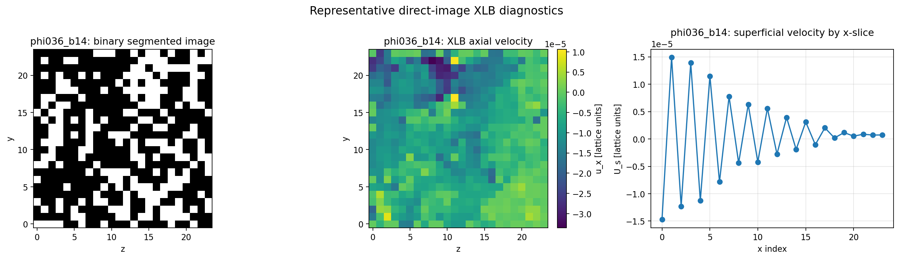
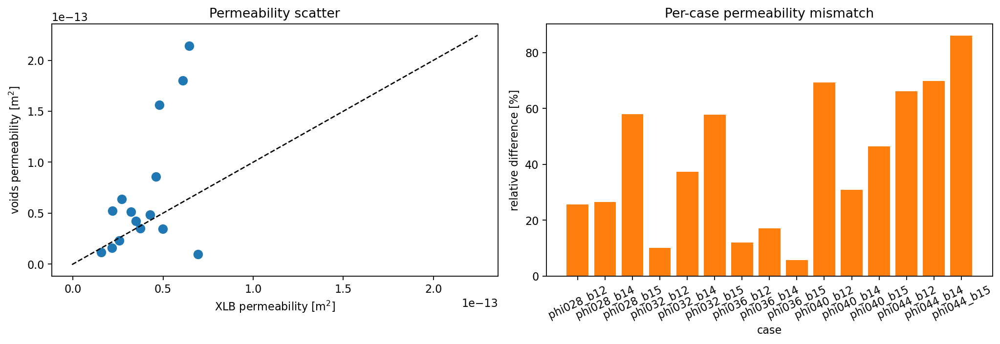

# XLB Direct-Image Permeability Benchmark

This report documents a controlled verification study of `voids` against a
voxel-scale lattice Boltzmann reference solved with XLB. The purpose is not to
replace pore-network modeling with LBM, but to quantify how closely the current
extracted-network workflow tracks a higher-fidelity direct-image calculation on
the same segmented geometry.

The reproducible artifact for this report is notebook
`notebooks/13_mwe_synthetic_volume_xlb_benchmark.ipynb`.

---

## Goal

The benchmark answers the following question:

Given the same binary segmented volume, how different is the absolute
permeability predicted by:

1. direct-image LBM on the voxel geometry, and
2. `voids` after `snow2` extraction and pore-network flow solution?

That is the scientifically relevant comparison for `voids`, because the main
approximation is not only the linear solver, but the reduction from voxel
geometry to an extracted pore-throat network.

---

## Methods

### `voids` PNM Workflow

For each binary image:

1. `snow2` extracts a pore network from the segmented volume.
2. The network is pruned to the axis-spanning subnetwork.
3. `voids` solves steady incompressible single-phase flow on that graph.

The `voids` pressure solve is the graph-Laplacian system

$$
\mathbf{A}\,\mathbf{p} = \mathbf{b},
$$

with throat fluxes

$$
q_t = g_t (p_i - p_j),
$$

where $g_t$ is the hydraulic conductance of throat $t$.

After solving the pore pressures, `voids` converts the inlet flow rate to
apparent permeability using Darcy's law:

$$
K = \frac{|Q|\,\mu\,L}{A\,|\Delta p|}.
$$

For this benchmark, the `voids` side uses:

- `conductance_model = "valvatne_blunt_baseline"`
- `solver = "direct"`
- $\mu = 1.0 \times 10^{-3}$ Pa s

The `valvatne_blunt_baseline` model is a pragmatic single-phase conduit model.
It prefers available shape-factor and conduit-length information when present,
but it is not a full reproduction of Valvatne-Blunt multiphase physics.

### XLB Direct-Image Workflow

The reference solve is run directly on the segmented binary image, without
network extraction.

The current XLB benchmark in `voids` uses:

- D3Q19 lattice for 3-D cases
- single-relaxation-time BGK collision
- `pull` streaming
- lattice viscosity $\nu_{\mathrm{lu}} = 0.10$
- density-driven pressure boundary conditions with
  $\rho_{\mathrm{inlet}} = 1.001$ and $\rho_{\mathrm{outlet}} = 1.000$
- half-way bounce-back on solid voxels
- sealed side walls orthogonal to the flow axis
- six fluid buffer cells before and after the sample so pressure BCs act on
  clean planar reservoir faces rather than directly on a perforated porous face

The benchmark uses the sample-averaged superficial axial velocity from the
original sample domain, not from the padded reservoir region.

Permeability is then recovered from lattice units as

$$
K_{\mathrm{phys}} =
\frac{
  \nu_{\mathrm{lu}}\,U_{\mathrm{lu}}\,L_{\mathrm{lu}}\,\Delta x_{\mathrm{phys}}^2
}{
  \Delta p_{\mathrm{lu}}
},
$$

with

$$
\Delta p_{\mathrm{lu}} = c_s^2 \left( \rho_{\mathrm{in}} - \rho_{\mathrm{out}} \right).
$$

This means the XLB side is used here as a permeability reference. It is not
being interpreted as a fully pressure-calibrated physical transient model.

---

## Why The Two Methods Differ

Even when both workflows are implemented correctly, they solve different
representations of the same sample.

| Aspect | `voids` | XLB |
|---|---|---|
| Geometry | Extracted pore-throat network | Original voxel image |
| Unknowns | One pressure unknown per pore | Distribution functions and velocity field per voxel |
| Transport law | Network conductance closure | Mesoscopic lattice Boltzmann dynamics |
| Solid treatment | Encoded indirectly through extracted geometry | Explicit bounce-back on solid voxels |
| Main approximation | Image-to-network reduction and conductance closure | Voxel staircasing, finite lattice resolution, BC discretization |

Therefore, mismatch between `voids` and XLB is not automatically a `voids` bug.
It can come from:

- loss of geometric information during extraction
- limitations of the selected pore-network conductance model
- voxel-resolution effects in the LBM reference
- boundary-condition sensitivity on small samples

---

## Synthetic Benchmark Setup

All cases in this report use:

- binary spanning volumes generated with `generate_spanning_blobs_matrix`
- shape `(24, 24, 24)`
- flow axis `x`
- voxel size `2.0e-6 m`
- fluid viscosity `1.0e-3 Pa s`
- XLB options:
  - `max_steps = 2500`
  - `min_steps = 400`
  - `check_interval = 50`
  - `steady_rtol = 1.0e-3`
  - `inlet_outlet_buffer_cells = 6`

The 15-case verification set spans five porosity levels and three blobiness
levels per porosity:

| Case | Target porosity | Blobiness | Seed used |
|---|---:|---:|---:|
| `phi028_b12` | 0.28 | 1.2 | 101 |
| `phi028_b14` | 0.28 | 1.4 | 135 |
| `phi028_b15` | 0.28 | 1.5 | 155 |
| `phi032_b12` | 0.32 | 1.2 | 271 |
| `phi032_b14` | 0.32 | 1.4 | 305 |
| `phi032_b15` | 0.32 | 1.5 | 322 |
| `phi036_b12` | 0.36 | 1.2 | 441 |
| `phi036_b14` | 0.36 | 1.4 | 475 |
| `phi036_b15` | 0.36 | 1.5 | 492 |
| `phi040_b12` | 0.40 | 1.2 | 611 |
| `phi040_b14` | 0.40 | 1.4 | 645 |
| `phi040_b15` | 0.40 | 1.5 | 662 |
| `phi044_b12` | 0.44 | 1.2 | 781 |
| `phi044_b14` | 0.44 | 1.4 | 815 |
| `phi044_b15` | 0.44 | 1.5 | 832 |

---

## Figures

Representative segmented slice, XLB axial velocity field, and superficial
velocity profile for case `phi036_b14`.

Left: `voids` permeability against XLB permeability with the one-to-one line.
Right: per-case relative difference.

Porosity-permeability trend for the 15-case set. This is useful for checking
whether `voids` follows the same macroscopic trend as the direct-image XLB
reference even when the pointwise agreement is imperfect.

---

## Results

The full CSV generated by the notebook is available here:
[xlb_15_case_results.csv](../assets/verification/xlb_15_case_results.csv).

| Case | Image porosity | `K_voids` [m^2] | `K_xlb` [m^2] | `K_voids / K_xlb` | Rel. diff. [%] | XLB steps | Converged |
|---|---:|---:|---:|---:|---:|---:|---:|
| `phi028_b12` | 0.280020 | 1.161e-14 | 1.563e-14 | 0.743 | 25.69 | 450 | yes |
| `phi028_b14` | 0.280020 | 1.598e-14 | 2.175e-14 | 0.735 | 26.54 | 400 | yes |
| `phi028_b15` | 0.280020 | 5.235e-14 | 2.201e-14 | 2.378 | 57.95 | 400 | yes |
| `phi032_b12` | 0.320023 | 2.308e-14 | 2.569e-14 | 0.898 | 10.17 | 2500 | yes |
| `phi032_b14` | 0.320023 | 5.138e-14 | 3.216e-14 | 1.598 | 37.41 | 1200 | yes |
| `phi032_b15` | 0.320023 | 6.371e-14 | 2.694e-14 | 2.365 | 57.72 | 1100 | yes |
| `phi036_b12` | 0.360026 | 4.851e-14 | 4.269e-14 | 1.136 | 12.00 | 1050 | yes |
| `phi036_b14` | 0.360026 | 4.214e-14 | 3.494e-14 | 1.206 | 17.08 | 2200 | yes |
| `phi036_b15` | 0.360026 | 3.517e-14 | 3.729e-14 | 0.943 | 5.68 | 400 | yes |
| `phi040_b12` | 0.400029 | 1.561e-13 | 4.793e-14 | 3.256 | 69.29 | 1850 | yes |
| `phi040_b14` | 0.400029 | 3.443e-14 | 4.977e-14 | 0.692 | 30.83 | 2350 | yes |
| `phi040_b15` | 0.400029 | 8.599e-14 | 4.609e-14 | 1.866 | 46.41 | 550 | yes |
| `phi044_b12` | 0.440032 | 1.799e-13 | 6.103e-14 | 2.949 | 66.08 | 1950 | yes |
| `phi044_b14` | 0.440032 | 2.143e-13 | 6.448e-14 | 3.323 | 69.91 | 400 | yes |
| `phi044_b15` | 0.440032 | 9.731e-15 | 6.948e-14 | 0.140 | 85.99 | 400 | yes |

Summary statistics for this 15-case set:

- mean relative difference: `41.25 %`
- median relative difference: `37.41 %`
- mean factor gap: `2.24 x`
- median factor gap: `1.60 x`
- worst factor gap: `7.14 x`

---

## Interpretation

These results support the following conclusions:

1. `voids` and XLB can agree quite closely on some cases. In this set,
   `phi036_b15` differs by only `5.68 %`.
2. The mismatch can still be substantial on other morphologies, reaching a
   factor gap of about `7.14 x` for `phi044_b15`.
3. The porosity-permeability trend is broadly similar between the methods, but
   the pointwise spread remains too large to treat the current extracted-network
   workflow as interchangeable with a direct-image LBM reference.

The practical interpretation is that the current `voids` image-to-network
workflow is plausible, but still morphology-sensitive relative to XLB. That is
exactly the kind of signal a verification benchmark should reveal.

---

## Limits Of This Verification

This report is intentionally narrow. It does **not** establish universal
agreement between `voids` and LBM.

Important limits and assumptions:

- the cases are small synthetic spanning volumes, not real rock images
- side walls are sealed in the XLB benchmark; periodic transverse boundaries are
  not used here
- `voids` is compared against one specific network conductance closure:
  `valvatne_blunt_baseline`
- the XLB permeability conversion is a lattice-unit permeability mapping, not a
  full dimensional calibration of the transient flow field
- a 15-case synthetic suite is useful for verification, but it is still not a
  statistically broad rock-physics validation campaign

So the correct reading is:

`voids` has been cross-checked against a direct-image XLB reference on a
controlled 15-case synthetic suite, and the remaining mismatch is now dominated
by model and representation differences rather than a sign error or obviously
broken numerics.
